# MODERN OPERATING SYSTEMS

## 1.1 APA ITU SISTEM OPERASI?

Sulit untuk menjelaskan apa itu sistem operasi selain mengatakan itu adalahperangkat lunak yang berjalan dalam mode kernel dan bahkan itu tidak selalu benar. Bagian dariMasalahnya adalah bahwa sistem operasi melakukan dua fungsi yang pada dasarnya tidak terkait:menyediakan programmer aplikasi (dan program aplikasi, tentu saja) yang bersihkumpulan sumber daya abstrak alih-alih perangkat keras yang berantakan dan mengelolanyasumber daya perangkat keras. Bergantung pada siapa yang berbicara, Anda mungkin mendengar sebagian besartentang satu fungsi atau yang lain. Sekarang mari kita lihat keduanya.

### 1.1.1 Sistem Operasi sebagai Mesin yang Diperpanjang

Arsitektur (set instruksi, organisasi memori, I/O, dan struktur bus) dari kebanyakan komputer pada tingkat bahasa mesin adalah primitif dan canggung untukprogram, terutama untuk input/output. Untuk membuat poin ini lebih konkret, pertimbangkanhard disk SATA (Serial ATA) modern yang digunakan di sebagian besar komputer. Sebuah buku (Ander son, 2007) menjelaskan versi awal dari antarmuka ke disk—apa yang harus diketahui oleh seorang programmer untuk menggunakan disk—berisi lebih dari 450 halaman. Sejak itu,antarmuka telah direvisi beberapa kali dan lebih rumit daripada sebelumnya1.    Jelas, tidak ada programmer waras yang mau berurusan dengan disk ini di tingkat perangkat keras. Sebagai gantinya, perangkat lunak, yang disebut driver disk, menangani perangkat keras dan menyediakan antarmuka untuk membaca dan menulis blok disk, tanpa masuk keRinciannya. Sistem operasi berisi banyak driver untuk mengontrol perangkat I/O.Tetapi bahkan level ini terlalu rendah untuk sebagian besar aplikasi. Untuk alasan ini, semuasistem operasi menyediakan lapisan abstraksi lain untuk menggunakan disk: file.Dengan menggunakan abstraksi ini, program dapat membuat, menulis, dan membaca file, tanpa harusberurusan dengan rincian berantakan tentang bagaimana perangkat keras benar-benar bekerja.Abstraksi ini adalah kunci untuk mengelola semua kerumitan ini. Abstraksi yang bagusmengubah tugas yang hampir mustahil menjadi dua tugas yang dapat dikelola. Yang pertama adalah mendefinisikan danmengimplementasikan abstraksi. Yang kedua adalah menggunakan abstraksi ini untuk menyelesaikanmasalah di tangan. Salah satu abstraksi yang dipahami oleh hampir setiap pengguna komputer adalahfile, seperti yang disebutkan di atas. Ini adalah informasi yang berguna, seperti digitalfoto, pesan email yang disimpan, lagu, atau halaman Web. Jauh lebih mudah untuk menangani foto, email, lagu, dan halaman Web daripada dengan detail disk SATA (atau lainnya).Tugas sistem operasi adalah membuat abstraksi yang baik dan kemudian mengimplementasikannyadan mengelola objek abstrak yang dibuat. Dalam buku ini, kita akan berbicara banyak tentangabstraksi. Mereka adalah salah satu kunci untuk memahami sistem operasi.Poin ini sangat penting sehingga perlu diulang dengan kata-kata yang berbeda. Dengan semuahormat kepada para insinyur industri yang merancang Macintosh dengan sangat hati-hati,perangkat kerasnya jelek. Prosesor nyata, memori, disk, dan perangkat lain sangatrumit dan menghadirkan antarmuka yang sulit, canggung, istimewa, dan tidak konsisten kepada orang-orang yang harus menulis perangkat lunak untuk menggunakannya. Terkadang ini karenadengan kebutuhan untuk kompatibilitas dengan perangkat keras yang lebih tua. Di lain waktu itu adalahusaha untuk menghemat uang. Namun, seringkali, perancang perangkat keras tidak menyadari (ataupeduli) berapa banyak masalah yang mereka sebabkan untuk perangkat lunak. Salah satu tugas utamadari sistem operasi adalah menyembunyikan perangkat keras dan menyajikan program (danprogrammer) dengan abstraksi yang bagus, bersih, elegan, konsisten, sebagai gantinya. Sistem operasi mengubah yang jelek menjadi indah, seperti yang ditunjukkan pada Gambar. 1-2

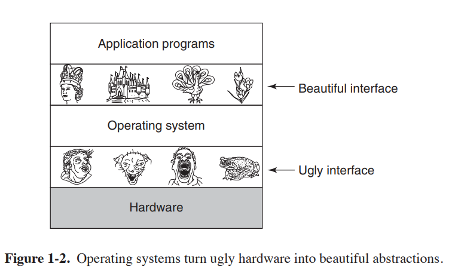

Perlu dicatat bahwa pelanggan nyata sistem operasi adalah program aplikasi (melalui pemrogram aplikasi, tentu saja). Mereka adalah orang-orangnya
yang berhubungan langsung dengan sistem operasi dan abstraksinya. Sebaliknya, akhir
pengguna berurusan dengan abstraksi yang disediakan oleh antarmuka pengguna, baik shell baris perintah atau antarmuka grafis. Sementara abstraksi di antarmuka pengguna
mungkin mirip dengan yang disediakan oleh sistem operasi, ini tidak selalu
kasus. Untuk memperjelas poin ini, pertimbangkan desktop Windows normal dan
prompt perintah berorientasi baris. Keduanya adalah program yang berjalan pada sistem operasi Windows dan menggunakan abstraksi yang disediakan Windows, tetapi keduanya menawarkan antarmuka pengguna yang sangat berbeda. Demikian pula, pengguna Linux yang menjalankan Gnome atau KDE melihat
antarmuka yang berbeda dari pengguna Linux yang bekerja langsung di atas X yang mendasarinya
Sistem Jendela, tetapi abstraksi sistem operasi yang mendasarinya sama dalam
kedua kasus.
Dalam buku ini, kita akan mempelajari abstraksi yang disediakan untuk program aplikasi di
sangat detail, tetapi tidak banyak bicara tentang antarmuka pengguna. Itu besar dan penting
subjek, tetapi hanya satu yang terkait dengan sistem operasi.

### 1.1.2 Sistem Operasi sebagai Resource Manager
Konsep sistem operasi yang terutama menyediakan abstraksi untuk program aplikasi adalah tampilan top-down. Pandangan alternatif, dari bawah ke atas, menyatakan bahwa
sistem operasi ada untuk mengelola semua bagian dari sistem yang kompleks. Komputer modern terdiri dari prosesor, memori, timer, disk, mouse, antarmuka jaringan, printer, dan berbagai perangkat lainnya. Dalam tampilan bottom-up, pekerjaan
sistem operasi adalah untuk menyediakan alokasi yang teratur dan terkendali dari
prosesor, memori, dan perangkat I/O di antara berbagai program yang menginginkannya.
Sistem operasi modern memungkinkan beberapa program berada di memori dan dijalankan
pada saat yang sama. Bayangkan apa yang akan terjadi jika tiga program berjalan pada beberapa
komputer semua mencoba untuk mencetak output mereka secara bersamaan pada printer yang sama. Pertama beberapa baris cetakan mungkin berasal dari program 1, beberapa baris berikutnya dari program 2, lalu
beberapa dari program 3, dan sebagainya. Hasilnya akan menjadi kekacauan total. Pengoperasian
sistem dapat menertibkan potensi kekacauan dengan menyangga semua output yang ditentukan
untuk printer pada disk. Ketika satu program selesai, sistem operasi dapat
kemudian salin outputnya dari file disk tempat disimpan untuk printer,
sementara pada saat yang sama program lain dapat terus menghasilkan lebih banyak output,
tidak menyadari fakta bahwa output tidak benar-benar masuk ke printer (belum).
Ketika komputer (atau jaringan) memiliki lebih dari satu pengguna, kebutuhan untuk mengelola
dan melindungi memori, perangkat I/O, dan sumber daya lainnya bahkan lebih sejak
pengguna dapat mengganggu satu sama lain. Selain itu, pengguna sering kali perlu
berbagi tidak hanya perangkat keras, tetapi juga informasi (file, database, dll.) Pendeknya,
pandangan sistem operasi ini menyatakan bahwa tugas utamanya adalah untuk melacak
program mana yang menggunakan sumber daya mana, untuk mengabulkan permintaan sumber daya, untuk memperhitungkan
untuk penggunaan, dan untuk menengahi permintaan yang bertentangan dari program dan pengguna yang berbeda.
Manajemen sumber daya mencakup multiplexing (berbagi) sumber daya dalam dua cara yang berbeda: dalam waktu dan dalam ruang. Ketika sumber daya digandakan waktu, berbeda
program atau pengguna bergiliran menggunakannya. Pertama, salah satu dari mereka dapat menggunakan sumber daya,
lalu yang lain, dan seterusnya. Misalnya, dengan hanya satu CPU dan beberapa program
yang ingin dijalankan di atasnya, sistem operasi terlebih dahulu mengalokasikan CPU ke satu program,
kemudian, setelah berjalan cukup lama, program lain akan menggunakan CPU, kemudian yang lain, dan akhirnya yang pertama lagi. Menentukan bagaimana sumber daya adalah waktu
multiplexing—siapa yang maju berikutnya dan untuk berapa lama—adalah tugas sistem operasi. Contoh lain dari multiplexing waktu adalah berbagi printer. Ketika banyak
pekerjaan cetak diantrekan untuk dicetak pada satu printer, keputusan harus dibuat
tentang mana yang akan dicetak berikutnya.
Jenis multiplexing lainnya adalah space multiplexing. Alih-alih pelanggan
bergiliran, masing-masing mendapat bagian dari sumber daya. Sebagai contoh, memori utama biasanya tidak dibagi di antara beberapa program yang sedang berjalan, sehingga masing-masing dapat menjadi residen di
waktu yang sama (misalnya, untuk bergiliran menggunakan CPU). Dengan asumsi ada
cukup memori untuk menampung banyak program, lebih efisien untuk menampung beberapa
program dalam memori sekaligus daripada memberikan salah satu dari mereka semua, terutama jika itu
hanya membutuhkan sebagian kecil dari total. Tentu saja hal ini menimbulkan masalah keadilan,
perlindungan, dan sebagainya, dan terserah pada sistem operasi untuk menyelesaikannya. Lain
sumber daya yang di-multipleks ruang adalah disk. Dalam banyak sistem, satu disk dapat
menyimpan file dari banyak pengguna secara bersamaan. Mengalokasikan ruang disk dan menyimpannya
melacak siapa yang menggunakan blok disk mana yang merupakan tugas khas sistem operasi.

## 1.2 SEJARAH SISTEM OPERASI

Sistem operasi telah berkembang selama bertahun-tahun. Pada bagian berikut kita akan melihat secara singkat beberapa hal yang menjadi sorotan. Karena sistem operasi memiliki
secara historis terkait erat dengan arsitektur komputer tempat mereka dijalankan, kita akan melihat generasi komputer yang berurutan untuk melihat seperti apa sistem operasinya. Pemetaan generasi sistem operasi ini ke komputer
generasi itu kasar, tetapi itu memberikan beberapa struktur di mana tidak ada yang bijaksana.
Perkembangan yang diberikan di bawah ini sebagian besar kronologis, tetapi telah bergelombang
mengendarai. Setiap pengembangan tidak menunggu sampai yang sebelumnya selesai dengan baik sebelumnya
mulai. Ada banyak tumpang tindih, belum lagi banyak awal yang salah dan
jalan buntu. Ambil ini sebagai panduan, bukan sebagai kata terakhir.
Komputer digital pertama yang benar dirancang oleh ahli matematika Inggris
Charles Babbage (1792–1871). Meskipun Babbage menghabiskan sebagian besar hidupnya dan mencari lagu untuk mencoba membangun ''mesin analitiknya,'' dia tidak pernah membuatnya bekerja dengan baik karena itu murni mekanis, dan teknologi pada zamannya tidak dapat menghasilkan
roda, roda gigi, dan roda gigi yang dibutuhkan dengan presisi tinggi yang dia butuhkan. Tidak perlu
untuk mengatakan, mesin analitik tidak memiliki sistem operasi.
Sebagai tambahan sejarah yang menarik, Babbage menyadari bahwa dia akan membutuhkan perangkat lunak untuk mesin analitiknya, jadi dia mempekerjakan seorang wanita muda bernama Ada Lovelace,
yang merupakan putri penyair Inggris terkenal Lord Byron, sebagai yang pertama di dunia
programmer. Bahasa pemrograman Ada® dinamai menurut namanya.

### 1.2.1 Generasi Pertama (1945–55): Tabung Vakum
Setelah upaya Babbage yang gagal, hanya sedikit kemajuan yang dibuat dalam konstruksi
komputer digital hingga periode Perang Dunia II, yang memicu ledakan
aktivitas. Profesor John Atanasoff dan mahasiswa pascasarjananya Clifford Berry membangun
apa yang sekarang dianggap sebagai komputer digital pertama yang berfungsi di Iowa State University. Ini digunakan 300 tabung vakum. Pada waktu yang hampir bersamaan, Konrad Zuse di Berlin
membangun komputer Z3 dari relai elektromekanis. Pada tahun 1944, Colossus adalah
dibangun dan diprogram oleh sekelompok ilmuwan (termasuk Alan Turing) di Bletchley
Park, Inggris, Mark I dibangun oleh Howard Aiken di Harvard, dan ENIAC
dibangun oleh William Mauchley dan mahasiswa pascasarjananya J. Presper Eckert di
Universitas Pennsylvania. Beberapa biner, beberapa menggunakan tabung vakum, beberapa
dapat diprogram, tetapi semuanya sangat primitif dan membutuhkan waktu beberapa detik untuk tampil merata
perhitungan paling sederhana.
Pada hari-hari awal ini, sekelompok orang (biasanya insinyur) merancang,
dibangun, diprogram, dioperasikan, dan dipelihara setiap mesin. Semua pemrograman adalah
dilakukan dalam bahasa mesin mutlak, atau bahkan lebih buruk lagi, dengan memasang kabel sirkuit listrik dengan menghubungkan ribuan kabel ke plugboard untuk mengontrol mesin
fungsi dasar. Bahasa pemrograman tidak diketahui (bahkan bahasa assembly
tidak diketahui). Sistem operasi tidak pernah terdengar sebelumnya. Mode operasi biasa
adalah untuk programmer untuk mendaftar untuk blok waktu menggunakan lembar pendaftaran di
dinding, lalu turun ke ruang mesin, masukkan plugboard-nya ke dalam
komputer, dan menghabiskan beberapa jam berikutnya berharap tidak ada 20.000 atau lebih tabung vakum yang terbakar selama pengoperasian. Hampir semua masalah itu sederhana perhitungan matematis dan numerik langsung, seperti penggilingan
tabel sinus, cosinus, dan logaritma, atau menghitung lintasan artileri.
Pada awal 1950-an, rutinitas sedikit membaik dengan diperkenalkannya
dari kartu berlubang. Sekarang mungkin untuk menulis program pada kartu dan membacanya di
alih-alih menggunakan plugboard; jika tidak, prosedurnya sama.

### 1.2.2 Generasi Kedua (1955–65): Transistor dan Sistem Batch
Pengenalan transistor pada pertengahan 1950-an mengubah gambaran secara radikal. Komputer menjadi cukup andal sehingga dapat diproduksi dan dijual
untuk membayar pelanggan dengan harapan bahwa mereka akan terus berfungsi lama
cukup untuk menyelesaikan pekerjaan yang bermanfaat. Untuk pertama kalinya, ada pemisahan yang jelas antara desainer, pembangun, operator, pemrogram, dan pemeliharaan per sonnel.
Mesin-mesin ini, sekarang disebut mainframe, dikunci dalam jumlah besar, khususnya
ruang komputer ber-AC, dengan staf operator profesional untuk menjalankannya.
Hanya perusahaan besar atau lembaga pemerintah atau universitas besar yang mampu
label harga jutaan dolar. Untuk menjalankan pekerjaan (yaitu, program atau serangkaian program),
seorang programmer pertama-tama akan menulis program di atas kertas (dalam FORTRAN atau assem bler), kemudian memencetnya di kartu. Dia kemudian akan membawa dek kartu ke input
kamar dan serahkan ke salah satu operator dan pergi minum kopi sampai outputnya
siap.
Ketika komputer menyelesaikan pekerjaan apa pun yang sedang dijalankannya, seorang operator
akan pergi ke printer dan merobek output dan membawanya ke output
ruangan, sehingga programmer bisa mengumpulkannya nanti. Kemudian dia akan mengambil salah satu dari
deck kartu yang telah dibawa dari ruang input dan membacanya. Jika kompiler FOR TRAN diperlukan, operator harus mendapatkannya dari lemari arsip
dan membacanya. Banyak waktu komputer terbuang saat operator berjalan
di sekitar ruang mesin.
Mengingat tingginya biaya peralatan, tidak mengherankan bahwa orang-orang dengan cepat
mencari cara untuk mengurangi waktu yang terbuang. Solusi yang umumnya diadopsi adalah
sistem batch. Ide di baliknya adalah untuk mengumpulkan baki yang penuh dengan pekerjaan di input
ruangan dan kemudian membacanya ke pita magnetik menggunakan komputer kecil (relatif) murah, seperti IBM 1401, yang cukup baik dalam membaca kartu,
menyalin kaset, dan mencetak hasil, tetapi sama sekali tidak pandai dalam perhitungan numerik.
Mesin lain yang jauh lebih mahal, seperti IBM 7094, digunakan untuk
komputasi nyata. Situasi ini ditunjukkan pada Gambar. 1-3.
Setelah sekitar satu jam mengumpulkan sejumlah pekerjaan, kartu-kartu itu dibacakan ke
pita magnetik, yang dibawa ke ruang mesin, di mana ia dipasang
sebuah kaset. Operator kemudian memuat program khusus (nenek moyang hari ini
sistem operasi), yang membaca pekerjaan pertama dari tape dan menjalankannya. Outputnya adalah
ditulis ke kaset kedua, bukannya dicetak. Setelah setiap pekerjaan selesai,
sistem operasi secara otomatis membaca pekerjaan berikutnya dari rekaman itu dan mulai berjalan

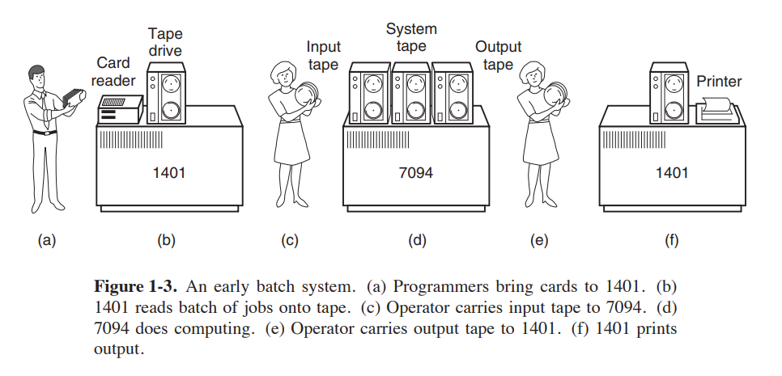

dia. Ketika seluruh batch selesai, operator menghapus input dan output
kaset, mengganti pita input dengan batch berikutnya, dan membawa pita keluaran ke a
1401 untuk mencetak off line (yaitu, tidak terhubung ke komputer utama).
Struktur pekerjaan input tipikal ditunjukkan pada Gambar. 1-4. Ini dimulai dengan
kartu $JOB, menentukan waktu berjalan maksimum dalam menit, nomor akun yang akan
dibebankan, dan nama programmer. Kemudian datang kartu $FORTRAN, memberi tahu
sistem operasi untuk memuat compiler FORTRAN dari sistem tape. Itu langsung diikuti oleh program yang akan dikompilasi, dan kemudian kartu $LOAD, mengarahkan
sistem operasi untuk memuat program objek yang baru saja dikompilasi. (Pro gram yang dikompilasi sering ditulis pada kaset awal dan harus dimuat secara eksplisit.) Selanjutnya
datang kartu $RUN, memberi tahu sistem operasi untuk menjalankan program dengan data
mengikutinya. Akhirnya, kartu $END menandai akhir dari pekerjaan. Primitif ini
kartu kontrol adalah cikal bakal shell modern dan penerjemah baris perintah.
Komputer generasi kedua yang besar sebagian besar digunakan untuk perhitungan ilmiah dan teknik, seperti memecahkan persamaan diferensial parsial yang sering terjadi dalam fisika dan teknik. Mereka sebagian besar diprogram dalam FORTRAN dan
bahasa campuran. Sistem operasi yang umum adalah FMS (Fortran Monitor
System) dan IBSYS, sistem operasi IBM untuk 7094.
### 1.2.3 Generasi Ketiga (1965–1980): IC dan Multiprogramming
Pada awal 1960-an, sebagian besar produsen komputer memiliki dua lini produk yang berbeda dan tidak kompatibel. Di satu sisi, ada komputer ilmiah skala besar yang berorientasi pada kata, seperti 7094, yang digunakan untuk perhitungan numerik kekuatan industri dalam sains dan teknik. Di sisi lain, ada

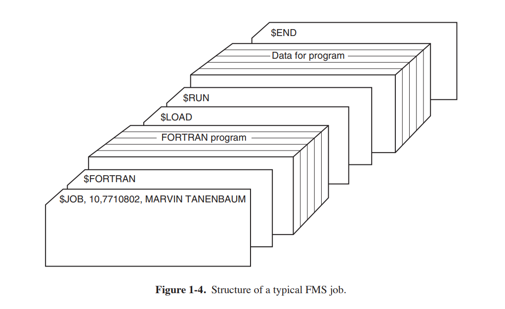

berorientasi karakter, komputer komersial, seperti 1401, yang secara luas
digunakan untuk penyortiran dan pencetakan pita oleh bank dan perusahaan asuransi.
Mengembangkan dan memelihara dua lini produk yang sama sekali berbeda merupakan proposisi yang mahal bagi produsen. Selain itu, banyak pelanggan komputer baru pada awalnya membutuhkan mesin kecil tetapi kemudian menjadi lebih besar dan menginginkan yang lebih besar
mesin yang akan menjalankan semua program lama mereka, tetapi lebih cepat.
IBM berusaha untuk memecahkan kedua masalah ini dengan satu langkah dengan memperkenalkan System/360. 360 adalah serangkaian mesin yang kompatibel dengan perangkat lunak mulai dari model berukuran 1401 hingga yang jauh lebih besar, lebih kuat daripada yang perkasa.
7094. Mesin hanya berbeda dalam harga dan kinerja (memori maksimum,
kecepatan prosesor, jumlah perangkat I/O yang diizinkan, dan sebagainya). Karena mereka semua memiliki
arsitektur dan set instruksi yang sama, program yang ditulis untuk satu mesin dapat
menjalankan semua yang lain-setidaknya dalam teori. (Tapi seperti yang dikatakan Yogi Berra: ''In
teori, teori dan praktek adalah sama; dalam praktiknya, mereka tidak.'') Sejak 360
dirancang untuk menangani komputasi ilmiah (yaitu, numerik) dan komersial,
satu keluarga mesin dapat memenuhi kebutuhan semua pelanggan. Selanjutnya
tahun, IBM keluar dengan penerus kompatibel ke garis 360, menggunakan
teknologi yang lebih modern, yang dikenal sebagai 370, 4300, 3080, dan 3090. Seri z
keturunan terbaru dari garis ini, meskipun telah menyimpang jauh dari
asli.
IBM 360 adalah lini komputer besar pertama yang menggunakan IC (skala kecil) (Inte grated Circuits), sehingga memberikan keunggulan harga/kinerja utama dibandingkan
mesin generasi kedua, yang dibangun dari transistor individu. Dia adalah sukses langsung, dan ide dari keluarga komputer yang kompatibel adalah
segera diadopsi oleh semua produsen besar lainnya. Keturunan dari mesin ini masih digunakan di pusat komputer sampai sekarang. Sekarang ini sering digunakan untuk
mengelola database besar (misalnya, untuk sistem reservasi maskapai penerbangan) atau sebagai server untuk
Situs World Wide Web yang harus memproses ribuan permintaan per detik.
Kekuatan terbesar dari ide '' keluarga tunggal '' secara bersamaan adalah kelemahan terbesarnya. Niat awalnya adalah bahwa semua perangkat lunak, termasuk operasi
sistem, OS/360, harus bekerja pada semua model. Itu harus berjalan pada sistem kecil, yang
sering kali hanya mengganti 1401 untuk menyalin kartu ke tape, dan pada sistem yang sangat besar,
yang sering menggantikan 7094 untuk melakukan prakiraan cuaca dan komputasi berat lainnya. Itu harus bagus pada sistem dengan sedikit periferal dan pada sistem dengan banyak
periferal. Itu harus bekerja di lingkungan komersial dan di lingkungan ilmiah. Di atas segalanya, itu harus efisien untuk semua kegunaan yang berbeda ini.
Tidak mungkin IBM (atau siapa pun dalam hal ini) dapat menulis
bagian dari perangkat lunak untuk memenuhi semua persyaratan yang saling bertentangan. Hasilnya adalah
sistem operasi yang sangat besar dan luar biasa kompleks, mungkin dua hingga tiga
urutan besarnya lebih besar dari FMS. Itu terdiri dari jutaan jalur perakitan
bahasa yang ditulis oleh ribuan programmer, dan berisi ribuan
ribuan bug, yang memerlukan aliran rilis baru secara terus-menerus dalam
mencoba untuk memperbaikinya. Setiap rilis baru memperbaiki beberapa bug dan memperkenalkan yang baru
yang, sehingga jumlah bug mungkin tetap konstan dari waktu ke waktu.
Salah satu desainer OS/360, Fred Brooks, kemudian menulis sebuah jenaka dan
buku tajam (Brooks, 1995) menggambarkan pengalamannya dengan OS/360. Sementara itu
tidak mungkin untuk meringkas buku di sini, cukup untuk mengatakan bahwa sampulnya
menunjukkan kawanan binatang prasejarah terjebak di lubang tar. Sampul Silberschatz dkk.
(2012) membuat poin serupa tentang sistem operasi yang menjadi dinosaurus.
Terlepas dari ukuran dan masalahnya yang sangat besar, OS/360 dan sistem operasi generasi ketiga serupa yang diproduksi oleh produsen komputer lain benar-benar memuaskan sebagian besar pelanggan mereka dengan cukup baik. Mereka juga mempopulerkan beberapa kunci
teknik yang tidak ada dalam sistem operasi generasi kedua. Mungkin yang paling penting adalah multiprogramming. Pada 7094, saat pekerjaan saat ini
dijeda untuk menunggu rekaman atau operasi I/O lainnya selesai, CPU hanya duduk
idle sampai I/O selesai. Dengan perhitungan ilmiah yang sangat terikat CPU, I/O adalah
jarang, jadi waktu yang terbuang ini tidak signifikan. Dengan pemrosesan data komersial,
waktu tunggu I/O seringkali bisa mencapai 80 atau 90% dari total waktu, jadi harus ada sesuatu
dilakukan untuk menghindari CPU (mahal) menganggur begitu banyak.
Solusi yang berkembang adalah dengan mempartisi memori menjadi beberapa bagian, dengan a
pekerjaan yang berbeda di setiap partisi, seperti yang ditunjukkan pada Gambar. 1-5. Sementara satu pekerjaan sedang menunggu
I/O selesai, pekerjaan lain bisa menggunakan CPU. Jika cukup banyak pekerjaan dapat diadakan
di memori utama sekaligus, CPU dapat tetap sibuk hampir 100% sepanjang waktu.
Memiliki banyak pekerjaan dengan aman di memori sekaligus membutuhkan perangkat keras khusus untuk melindungi
setiap pekerjaan melawan pengintaian dan kerusakan oleh yang lain, tetapi 360 dan lainnya
sistem generasi ketiga dilengkapi dengan perangkat keras ini.

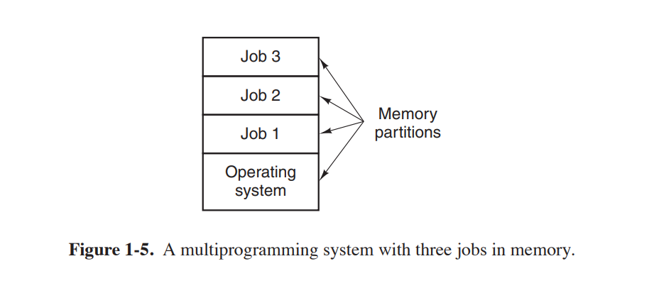

Fitur utama lain yang ada dalam sistem operasi generasi ketiga adalah
kemampuan untuk membaca pekerjaan dari kartu ke disk segera setelah dibawa ke
ruang komputer. Kemudian, setiap kali pekerjaan yang sedang berjalan selesai, sistem operasi dapat
memuat pekerjaan baru dari disk ke partisi yang sekarang kosong dan menjalankannya. Teknik ini disebut spooling (dari Simultaneous Peripheral Operation On Line) dan
juga digunakan untuk keluaran. Dengan spooling, 1401 tidak lagi diperlukan, dan
banyak membawa kaset menghilang.
Meskipun sistem operasi generasi ketiga sangat cocok untuk ilmiah besar
perhitungan dan pemrosesan data komersial besar-besaran, pada dasarnya mereka masih
sistem batch. Banyak programmer merindukan hari-hari generasi pertama ketika mereka
memiliki mesin untuk diri mereka sendiri selama beberapa jam, sehingga mereka dapat men-debug pro gram mereka dengan cepat. Dengan sistem generasi ketiga, waktu antara mengirimkan pekerjaan
dan mendapatkan kembali hasilnya seringkali beberapa jam, jadi satu koma salah tempat
dapat menyebabkan kompilasi gagal, dan pemrogram membuang waktu setengah hari. Pro grammer tidak begitu menyukainya.
Keinginan untuk waktu respons yang cepat ini membuka jalan bagi pembagian waktu, sebuah varian
multiprogramming, di mana setiap pengguna memiliki terminal online. Dalam pembagian waktu
sistem, jika 20 pengguna masuk dan 17 dari mereka berpikir atau berbicara atau minum
kopi, CPU dapat dialokasikan secara bergantian ke tiga pekerjaan yang menginginkan layanan. Sejak
orang yang men-debug program biasanya mengeluarkan perintah pendek (misalnya, mengkompilasi prosedur lima halaman†) daripada yang panjang (misalnya, mengurutkan satu juta file rekaman), komputer dapat menyediakan layanan yang cepat dan interaktif ke sejumlah pengguna dan mungkin juga
mengerjakan pekerjaan batch besar di latar belakang saat CPU tidak digunakan. Itu
sistem timesharing tujuan umum pertama, CTSS (Compatible Time Sharing System), dikembangkan di M.I.T. pada 7094 yang dimodifikasi secara khusus (Corbato´ et al., 1962).
Namun, pembagian waktu tidak benar-benar menjadi populer sampai perlindungan yang diperlukan
perangkat keras menjadi luas selama generasi ketiga.
Setelah keberhasilan sistem CTSS, M.I.T., Bell Labs, dan General Electric
(pada saat itu produsen komputer besar) memutuskan untuk memulai pengembangan "utilitas komputer", yaitu, mesin yang akan mendukung beberapa ratus pengguna timesharing simultan. Model mereka adalah sistem kelistrikan—ketika
Anda membutuhkan tenaga listrik, Anda cukup memasang steker di dinding, dan dengan alasan, sebagai
banyak kekuatan yang Anda butuhkan akan ada di sana. Perancang sistem ini, yang dikenal sebagai
MULTICS (Layanan Informasi dan Komputasi MULTIplexed), dibayangkan
satu mesin besar yang menyediakan daya komputasi untuk semua orang di wilayah Boston.
Gagasan bahwa mesin 10.000 kali lebih cepat daripada mainframe GE-645 mereka adalah
dijual (dengan harga di bawah $ 1000) oleh jutaan hanya 40 tahun kemudian adalah sains murni
fiksi. Semacam ide kereta bawah laut supersonik trans-Atlantik sekarang.
MULTICS adalah sukses campuran. Itu dirancang untuk mendukung ratusan pengguna
pada mesin hanya sedikit lebih kuat daripada PC berbasis Intel 386, meskipun
memiliki lebih banyak kapasitas I/O. Ini tidak terlalu gila kedengarannya, karena di dalamnya
hari orang tahu bagaimana menulis kecil, program efisien, keterampilan yang kemudian benar-benar hilang. Ada banyak alasan mengapa MULTICS tidak
mengambil alih dunia, tidak sedikit yang ditulis dalam bahasa pemrograman PL/I, dan kompiler PL/I terlambat bertahun-tahun dan hampir tidak berfungsi sama sekali
ketika akhirnya tiba. Selain itu, MULTICS sangat ambisius untuk
waktu, seperti mesin analitik Charles Babbage di abad kesembilan belas.
Untuk mempersingkat cerita, MULTICS memperkenalkan banyak ide mani ke dalam
literatur komputer, tetapi mengubahnya menjadi produk yang serius dan komersial utama
kesuksesan jauh lebih sulit daripada yang diperkirakan siapa pun. Bell Labs keluar dari
proyek, dan General Electric keluar dari bisnis komputer sama sekali. Namun,
M.I.T. bertahan dan akhirnya membuat MULTICS bekerja. Itu akhirnya dijual sebagai
produk komersial oleh perusahaan (Honeywell) yang membeli bisnis komputer GE dan dipasang oleh sekitar 80 perusahaan besar dan universitas di seluruh dunia.
Meskipun jumlahnya sedikit, pengguna MULTICS sangat setia. Umum
Motors, Ford, dan Badan Keamanan Nasional AS, misalnya, menutup
Sistem MULTICS hanya di akhir 1990-an, 30 tahun setelah MULTICS dirilis,
setelah bertahun-tahun mencoba membuat Honeywell memperbarui perangkat kerasnya.
Pada akhir abad ke-20, konsep utilitas komputer telah gagal
keluar, tetapi mungkin kembali dalam bentuk komputasi awan, di mana komputer yang relatif kecil (termasuk smartphone, tablet, dan sejenisnya) terhubung ke server di pusat data yang luas dan jauh di mana semua komputasi dilakukan ,
dengan komputer lokal hanya menangani antarmuka pengguna. Motivasi disini adalah
bahwa kebanyakan orang tidak ingin administrasi yang semakin kompleks dan rewel
sistem komputer dan lebih suka pekerjaan itu dilakukan oleh tim profesional, misalnya, orang yang bekerja untuk perusahaan yang menjalankan pusat data. Merce e-com sudah berkembang ke arah ini, dengan berbagai perusahaan menjalankan email
pada server multiprosesor yang terhubung dengan mesin klien sederhana, sangat banyak
semangat desain MULTICS.
Meskipun kurang sukses secara komersial, MULTICS memiliki pengaruh besar pada
sistem operasi berikutnya (terutama UNIX dan turunannya, FreeBSD,
Linux, iOS, dan Android). Hal ini dijelaskan dalam beberapa makalah dan buku (Corbato´ et
al., 1972; Corbato´ dan Vyssotsky, 1965; Daley dan Dennis, 1968; Organik, 1972; dan Saltzer, 1974). Ia juga memiliki Situs Web aktif, yang terletak di www.multicians.org,
dengan banyak informasi tentang sistem, perancangnya, dan penggunanya.
Perkembangan besar lainnya selama generasi ketiga adalah fenomenal
pertumbuhan komputer mini, dimulai dengan DEC PDP-1 pada tahun 1961. PDP-1 memiliki
hanya 4K kata 18-bit, tetapi pada $ 120.000 per mesin (kurang dari 5% dari harga
a 7094), itu dijual seperti kacang goreng. Untuk jenis pekerjaan nonnumerik tertentu, itu hampir secepat tahun 7094 dan melahirkan industri yang sama sekali baru. Itu dengan cepat diikuti oleh serangkaian PDP lain (tidak seperti keluarga IBM, semuanya tidak kompatibel) yang berpuncak pada PDP-11.
Salah satu ilmuwan komputer di Bell Labs yang pernah mengerjakan MULTICS
proyek, Ken Thompson, kemudian menemukan komputer mini PDP-7 kecil yang tidak
salah satunya menggunakan dan mulai menulis MULTICS versi satu pengguna yang dilucuti.
Karya ini kemudian berkembang menjadi sistem operasi UNIX, yang menjadi populer
di dunia akademik, dengan instansi pemerintah, dan dengan banyak perusahaan.
Sejarah UNIX telah diceritakan di tempat lain (misalnya, Salus, 1994). Bagian dari itu
cerita akan diberikan di Bab. 10. Untuk saat ini, cukup dikatakan demikian karena sumbernya
kode tersedia secara luas, berbagai organisasi mengembangkan versi mereka sendiri (tidak kompatibel), yang menyebabkan kekacauan. Dua versi utama dikembangkan, Sistem V, dari
AT&T, dan BSD (Distribusi Perangkat Lunak Berkeley) dari University of Cali fornia di Berkeley. Ini memiliki varian kecil juga. Untuk memungkinkan menulis
program yang dapat berjalan pada sistem UNIX apa pun, IEEE mengembangkan standar untuk
UNIX, disebut POSIX, yang sekarang didukung oleh sebagian besar versi UNIX. POSIX mendefinisikan a
antarmuka panggilan sistem minimal yang harus didukung oleh sistem UNIX yang sesuai. Di
faktanya, beberapa sistem operasi lain sekarang juga mendukung antarmuka POSIX.
Sebagai tambahan, perlu disebutkan bahwa pada tahun 1987, penulis merilis sedikit
tiruan dari UNIX, yang disebut MINIX, untuk tujuan pendidikan. Secara fungsional, MINIX adalah
sangat mirip dengan UNIX, termasuk dukungan POSIX. Sejak saat itu, versi aslinya telah berkembang menjadi MINIX 3, yang sangat modular dan berfokus pada sangat tinggi
keandalan. Ia memiliki kemampuan untuk mendeteksi dan mengganti modul yang rusak atau bahkan macet
(seperti driver perangkat I/O) dengan cepat tanpa reboot dan tanpa mengganggu program yang sedang berjalan. Fokusnya adalah menyediakan ketergantungan dan ketersediaan yang sangat tinggi.
Sebuah buku yang menjelaskan operasi internal dan daftar kode sumber dalam lampiran
juga tersedia (Tanenbaum dan Woodhull, 2006). Sistem MINIX 3 tersedia secara gratis (termasuk semua kode sumber) melalui Internet di www.minix3.org.
Keinginan untuk produksi gratis (sebagai lawan dari pendidikan) versi MINIX
memimpin seorang mahasiswa Finlandia, Linus Torvalds, untuk menulis Linux. Sistem ini secara langsung
terinspirasi oleh dan dikembangkan pada MINIX dan awalnya mendukung berbagai fitur MINIX (mis., Sistem file MINIX). Sejak itu telah diperpanjang dalam banyak cara oleh
banyak orang tetapi masih mempertahankan beberapa struktur dasar yang umum untuk MINIX dan untuk
UNIX. Pembaca yang tertarik dengan sejarah rinci Linux dan open source
gerakan mungkin ingin membaca buku Glyn Moody (2001). Sebagian besar dari apa yang akan terjadi
dikatakan tentang UNIX dalam buku ini dengan demikian berlaku untuk Sistem V, MINIX, Linux, dan lainnya
versi dan klon UNIX juga.

### 1.2.4 Generasi Keempat (1980–Sekarang): Komputer Pribadi
Dengan berkembangnya sirkuit LSI (Large Scale Integration)—chip yang berisi ribuan transistor pada satu sentimeter persegi silikon—usia
komputer pribadi muncul. Dalam hal arsitektur, komputer pribadi (awalnya
disebut mikrokomputer) tidak jauh berbeda dari komputer mini
Kelas PDP-11, tapi dari segi harga tentu berbeda. Dimana
komputer mini memungkinkan departemen di perusahaan atau universitas untuk memiliki
komputernya sendiri, chip mikroprosesor memungkinkan untuk satu individu
memiliki komputer pribadinya sendiri.
Pada tahun 1974, ketika Intel keluar dengan 8080, tujuan umum pertama 8-bit
CPU, ia menginginkan sistem operasi untuk 8080, sebagian untuk dapat mengujinya. Intel
meminta salah satu konsultannya, Gary Kildall, untuk menulis satu. Kildall dan seorang teman dulu
membuat pengontrol untuk floppy disk 8 inci Shugart Associates yang baru dirilis dan
menghubungkan floppy disk hingga 8080, sehingga menghasilkan komputer mikro pertama dengan
sebuah disk. Kildall kemudian menulis sistem operasi berbasis disk yang disebut CP/M (Kontrol
Program untuk Mikrokomputer) untuk itu. Karena Intel tidak berpikir bahwa berbasis disk
mikrokomputer memiliki banyak masa depan, ketika Kildall meminta hak atas CP/M,
Intel mengabulkan permintaannya. Kildall kemudian membentuk sebuah perusahaan, Digital Research, untuk lebih mengembangkan dan menjual CP/M.
Pada tahun 1977, Digital Research menulis ulang CP/M agar cocok untuk dijalankan di
banyak mikrokomputer yang menggunakan 8080, Zilog Z80, dan chip CPU lainnya. Banyak program aplikasi yang ditulis untuk dijalankan pada CP/M, memungkinkannya untuk sepenuhnya mendominasi dunia mikrokomputer selama sekitar 5 tahun.
Pada awal 1980-an, IBM merancang PC IBM dan mencari-cari perangkat lunak
untuk berlari di atasnya. Orang-orang dari IBM menghubungi Bill Gates untuk melisensikan penerjemah BASIC-nya. Mereka juga bertanya apakah dia tahu sistem operasi yang bisa dijalankan di PC.
Gates menyarankan agar IBM menghubungi Digital Research, yang saat itu merupakan perusahaan sistem operasi yang dominan di dunia. Membuat apa yang pasti merupakan keputusan bisnis terburuk dalam
mencatat sejarah, Kildall menolak bertemu dengan IBM, malah mengirim bawahan.
Lebih buruk lagi, pengacaranya bahkan menolak menandatangani kerahasiaan IBM
perjanjian yang mencakup PC yang belum diumumkan. Akibatnya, IBM kembali ke
Gates bertanya apakah dia bisa memberi mereka sistem operasi.
Ketika IBM kembali, Gates menyadari bahwa produsen komputer lokal,
Seattle Computer Products, memiliki sistem operasi yang sesuai, DOS (Disk Operat ing System). Dia mendekati mereka dan meminta untuk membelinya (diduga seharga $75.000),
yang mereka terima dengan senang hati. Gates kemudian menawarkan paket DOS/BASIC kepada IBM,
yang diterima IBM. IBM menginginkan modifikasi tertentu, jadi Gates mempekerjakan orang yang menulis DOS, Tim Paterson, sebagai karyawan perusahaan baru Gates,
Microsoft, untuk membuatnya. Sistem yang direvisi diubah namanya menjadi MS-DOS (MicroSoft
Disk Operating System) dan dengan cepat mendominasi pasar PC IBM. SEBUAH
faktor kunci di sini adalah keputusan Gates (dalam retrospeksi, sangat bijaksana) untuk menjual MS-DOS
ke perusahaan komputer untuk bundling dengan perangkat keras mereka, dibandingkan dengan Kildall's mencoba menjual CP/M kepada pengguna akhir satu per satu (setidaknya pada awalnya). Setelah semua ini
terjadi, Kildall meninggal tiba-tiba dan tak terduga dari penyebab yang belum
diungkapkan sepenuhnya.
Pada saat penerus IBM PC, IBM PC/AT, keluar pada tahun 1983
dengan CPU Intel 80286, MS-DOS tertanam kuat dan CP/M berada di posisinya
kaki terakhir. MS-DOS kemudian banyak digunakan pada 80386 dan 80486. Meskipun
versi awal MS-DOS cukup primitif, versi selanjutnya termasuk lebih banyak
fitur-fitur canggih, termasuk banyak yang diambil dari UNIX. (Microsoft sangat menyadari
UNIX, bahkan menjual versi mikrokomputer yang disebut XENIX selama
tahun-tahun awal perusahaan.)
CP/M, MS-DOS, dan sistem operasi lain untuk mikrokomputer awal adalah
semua berdasarkan pengguna yang mengetikkan perintah dari keyboard. Itu akhirnya berubah karena penelitian yang dilakukan oleh Doug Engelbart di Stanford Research Institute di
1960-an. Engelbart menemukan Graphical User Interface, lengkap dengan windows,
ikon, menu, dan mouse. Ide-ide ini diadopsi oleh para peneliti di Xerox PARC
dan dimasukkan ke dalam mesin yang mereka buat.
Suatu hari, Steve Jobs, yang ikut menciptakan komputer Apple di garasinya, mengunjungi PARC, melihat GUI, dan segera menyadari nilai potensialnya, sesuatu yang Xerox
manajemen terkenal tidak. Kesalahan strategis dengan proporsi raksasa ini
menghasilkan sebuah buku berjudul Meraba-raba Masa Depan (Smith dan Alexander, 1988). Pekerjaan kemudian
memulai membangun Apple dengan GUI. Proyek ini mengarah ke Lisa, yang
terlalu mahal dan gagal secara komersial. Upaya kedua Jobs, Apple Mac intosh, sukses besar, bukan hanya karena jauh lebih murah daripada Lisa,
tetapi juga karena ramah pengguna, artinya ditujukan untuk pengguna yang
tidak hanya tahu apa-apa tentang komputer tetapi lebih jauh lagi sama sekali tidak ada niat belajar apa pun. Dalam dunia kreatif desain grafis, profesional
fotografi digital, dan produksi video digital profesional, Macintoshes adalah
sangat banyak digunakan dan pengguna mereka sangat antusias tentang mereka. Pada tahun 1999, Apple
mengadopsi kernel yang berasal dari mikrokernel Mach Universitas Carnegie Mellon
yang awalnya dikembangkan untuk menggantikan kernel BSD UNIX. Jadi, Mac
OS X adalah sistem operasi berbasis UNIX, meskipun dengan antarmuka yang sangat khas.
Ketika Microsoft memutuskan untuk membangun penerus MS-DOS, itu sangat
dipengaruhi oleh keberhasilan Macintosh. Ini menghasilkan sistem berbasis GUI yang disebut ed Windows, yang awalnya berjalan di atas MS-DOS (yaitu, itu lebih seperti shell
daripada sistem operasi yang sebenarnya). Selama sekitar 10 tahun, dari 1985 hingga 1995, Windows
hanyalah lingkungan grafis di atas MS-DOS. Namun, mulai tahun 1995 a
versi berdiri bebas, Windows 95, dirilis yang menggabungkan banyak operasi
fitur sistem ke dalamnya, menggunakan sistem MS-DOS yang mendasarinya hanya untuk booting dan
menjalankan program MS-DOS lama. Pada tahun 1998, versi yang sedikit dimodifikasi dari sistem ini, yang disebut Windows 98 dirilis. Namun demikian, baik Windows 95 dan Windows 98 masih berisi sejumlah besar bahasa rakitan Intel 16-bit.
Sistem operasi Microsoft lainnya, Windows NT (di mana NT adalah singkatan dari
Teknologi Baru), yang kompatibel dengan Windows 95 pada tingkat tertentu, tetapi a menulis ulang lengkap dari awal secara internal. Itu adalah sistem 32-bit penuh. Penandatangan utama untuk Windows NT adalah David Cutler, yang juga merupakan salah satu desainer dari
Sistem operasi VAX VMS, jadi beberapa ide dari VMS hadir di NT. Faktanya,
begitu banyak ide dari VMS yang hadir di dalamnya sehingga pemilik VMS, DEC, menggugat
Microsoft. Kasus ini diselesaikan di luar pengadilan untuk sejumlah uang yang membutuhkan
banyak angka untuk diekspresikan. Microsoft berharap bahwa versi pertama NT akan membunuh
mematikan MS-DOS dan semua versi Windows lainnya karena ini adalah sistem yang jauh lebih unggul, tetapi gagal. Hanya dengan Windows NT 4.0 akhirnya berhasil,
terutama pada jaringan perusahaan. Versi 5 Windows NT berganti nama menjadi Win dows 2000 pada awal 1999. Ini dimaksudkan untuk menjadi penerus kedua Windows 98
dan Windows NT 4.0.
Itu juga tidak berhasil, jadi Microsoft mengeluarkan versi lain dari Windows 98 yang disebut Windows Me (Edisi Milenium). Pada tahun 2001,
sedikit upgrade versi Windows 2000, yang disebut Windows XP dirilis.
Versi tersebut telah berjalan lebih lama (6 tahun), pada dasarnya menggantikan semua versi Windows sebelumnya.
Masih pemijahan versi terus berlanjut. Setelah Windows 2000,
Microsoft memecah keluarga Windows menjadi klien dan baris server. Klien
baris didasarkan pada XP dan penerusnya, sedangkan baris server termasuk Windows
Server 2003 dan Windows 2008. Baris ketiga, untuk dunia tertanam, muncul sebagai
sedikit kemudian. Semua versi Windows ini mengubah variasinya dalam bentuk
dari paket layanan. Itu sudah cukup untuk membuat beberapa administrator (dan penulis buku teks sistem operasi) nyaman.
Kemudian pada Januari 2007, Microsoft akhirnya merilis penerus Windows
XP, disebut Vista. Itu datang dengan antarmuka grafis baru, keamanan yang ditingkatkan, dan
banyak program pengguna baru atau yang ditingkatkan. Microsoft berharap itu akan menggantikan Windows
XP sepenuhnya, tetapi tidak pernah berhasil. Sebaliknya, ia menerima banyak kritik dan pers yang buruk,
sebagian besar karena persyaratan sistem yang tinggi, persyaratan lisensi yang ketat, dan dukungan untuk Manajemen Hak Digital, teknik yang mempersulit pengguna untuk
menyalin materi yang dilindungi.
Dengan kedatangan Windows 7, versi baru yang haus sumber daya jauh lebih sedikit
dari sistem operasi, banyak orang memutuskan untuk melewatkan Vista sama sekali. Windows 7
tidak memperkenalkan terlalu banyak fitur baru, tetapi relatif kecil dan cukup stabil. Dalam waktu kurang dari tiga minggu, Windows 7 telah memperoleh lebih banyak pangsa pasar daripada
Vista dalam tujuh bulan. Pada tahun 2012, Microsoft meluncurkan penggantinya, Windows 8, dan
sistem operasi dengan tampilan dan nuansa yang benar-benar baru, ditujukan untuk layar sentuh.
Perusahaan berharap bahwa desain baru akan menjadi sistem operasi yang dominan pada berbagai perangkat yang lebih luas: desktop, laptop, notebook, tablet,
telepon, dan PC home theater. Namun sejauh ini penetrasi pasarnya lambat
dibandingkan dengan Windows 7.
Pesaing utama lainnya di dunia komputer pribadi adalah UNIX (dan
berbagai turunan). UNIX adalah yang terkuat di server jaringan dan perusahaan tetapi
juga sering hadir di komputer desktop, notebook, tablet, dan smartphone. Pada komputer berbasis x86, Linux menjadi alternatif populer untuk Windows untuk pelajar dan pengguna korporat yang semakin banyak.
Sebagai tambahan, di seluruh buku ini kita akan menggunakan istilah x86 untuk merujuk ke semua prosesor modern berdasarkan keluarga arsitektur set instruksi yang dimulai dengan
8086 pada 1970-an. Ada banyak prosesor seperti itu, yang diproduksi oleh perusahaan seperti AMD dan Intel, dan di bawah tenda mereka sering sangat berbeda:
prosesor mungkin 32 bit atau 64 bit dengan sedikit atau banyak inti dan saluran pipa yang mungkin
dalam atau dangkal, dan sebagainya. Namun demikian, bagi programmer, mereka semua terlihat cukup
serupa dan semuanya masih dapat menjalankan kode 8086 yang ditulis 35 tahun yang lalu. Di mana
perbedaannya penting, kami akan merujuk ke model eksplisit sebagai gantinya — dan gunakan
x86-32 dan x86-64 untuk menunjukkan varian 32-bit dan 64-bit.
FreeBSD juga merupakan turunan UNIX yang populer, yang berasal dari proyek BSD
di Berkeley. Semua komputer Macintosh modern menjalankan versi modifikasi dari FreeBSD
(OSX). UNIX juga standar pada workstation yang didukung oleh kinerja tinggi
chip RISC. Turunannya banyak digunakan pada perangkat seluler, seperti yang menjalankan iOS 7 atau Android.
Banyak pengguna UNIX, terutama programmer berpengalaman, lebih memilih antarmuka berbasis perintah daripada GUI, sehingga hampir semua sistem UNIX mendukung sistem windowing.
disebut X Window System (juga dikenal sebagai X11) yang diproduksi di M.I.T. Sistem ini menangani manajemen jendela dasar, memungkinkan pengguna untuk membuat, menghapus, memindahkan,
dan mengubah ukuran jendela menggunakan mouse. Seringkali GUI lengkap, seperti Gnome atau
KDE, tersedia untuk dijalankan di atas X11, memberikan UNIX tampilan dan rasa sesuatu
seperti Macintosh atau Microsoft Windows, bagi para pengguna UNIX yang menginginkan
hal.
Perkembangan menarik yang mulai terjadi pada pertengahan 1980-an adalah
pertumbuhan jaringan komputer pribadi yang menjalankan sistem operasi jaringan dan sistem operasi terdistribusi (Tanenbaum dan Van Steen, 2007). Di sebuah
sistem operasi jaringan, pengguna menyadari keberadaan beberapa komputer dan dapat masuk ke mesin jarak jauh dan menyalin file dari satu mesin ke mesin lainnya. Setiap mesin menjalankan sistem operasi lokalnya sendiri dan memiliki pengguna lokalnya sendiri
(atau pengguna).
Sistem operasi jaringan pada dasarnya tidak berbeda dari sistem operasi prosesor tunggal. Mereka jelas membutuhkan pengontrol antarmuka jaringan dan
beberapa perangkat lunak tingkat rendah untuk menjalankannya, serta program untuk mencapai login jarak jauh
dan akses file jarak jauh, tetapi penambahan ini tidak mengubah struktur penting dari
sistem operasi.
Sebuah sistem operasi terdistribusi, sebaliknya, adalah salah satu yang muncul kepada penggunanya sebagai
sistem uniprosesor tradisional, meskipun sebenarnya terdiri dari beberapa
prosesor. Pengguna seharusnya tidak mengetahui di mana program mereka dijalankan atau
di mana file mereka berada; yang semuanya harus ditangani secara otomatis dan efisien oleh sistem operasi.
Sistem operasi terdistribusi sejati membutuhkan lebih dari sekadar menambahkan sedikit kode
ke sistem operasi uniprosesor, karena sistem terdistribusi dan terpusat berbeda dalam cara-cara kritis tertentu. Sistem terdistribusi, misalnya, sering memungkinkan aplikasi untuk berjalan pada beberapa prosesor pada saat yang sama, sehingga membutuhkan lebih kompleks.
algoritma penjadwalan prosesor untuk mengoptimalkan jumlah paralelisme.
Keterlambatan komunikasi dalam jaringan sering berarti bahwa ini (dan lainnya)
algoritma harus berjalan dengan informasi yang tidak lengkap, usang, atau bahkan salah. Ini
situasi berbeda secara radikal dari sistem prosesor tunggal di mana sistem operasi memiliki informasi lengkap tentang status sistem.
### 1.2.5 Generasi Kelima (1990–Sekarang): Komputer Seluler
Sejak detektif Dick Tracy mulai berbicara dengan '' pergelangan tangan radio dua arahnya '
menonton '' di komik strip 1940-an, orang-orang mendambakan perangkat komunikasi mereka
bisa dibawa kemanapun mereka pergi. Ponsel asli pertama muncul di
1946 dan beratnya sekitar 40 kilogram. Anda bisa membawanya ke mana pun Anda pergi selama
Anda memiliki mobil untuk membawanya.
Telepon genggam pertama yang benar muncul pada tahun 1970-an dan, dengan berat kira-kira satu kilo gram, benar-benar kelas bulu. Itu dikenal sebagai '' batu bata. ''
Segera semua orang menginginkannya. Saat ini, penetrasi ponsel sudah dekat dengan
90% dari populasi dunia. Kami dapat melakukan panggilan tidak hanya dengan ponsel portabel kami
dan jam tangan, tetapi segera dengan kacamata dan barang-barang yang dapat dikenakan lainnya. Lebih-lebih lagi,
bagian telepon tidak lagi menarik. Kami menerima email, menjelajahi Web, SMS
teman-teman kita, bermain game, bernavigasi di lalu lintas padat—dan bahkan tidak berpikir
dua kali tentang itu.
Sementara gagasan menggabungkan telepon dan komputasi dalam perangkat seperti telepon
telah ada sejak tahun 1970-an juga, smartphone asli pertama tidak muncul sampai
pertengahan 1990-an ketika Nokia merilis N9000, yang secara harfiah menggabungkan dua,
sebagian besar perangkat terpisah: telepon dan PDA (Personal Digital Assistant). Pada tahun 1997,
Ericsson menciptakan istilah smartphone untuk GS88-nya ''Penelope.''
Sekarang smartphone telah menjadi di mana-mana, persaingan antara
berbagai sistem operasi ganas dan hasilnya bahkan kurang jelas daripada di
Dunia PC. Pada saat penulisan, Android Google adalah sistem operasi yang dominan dengan iOS Apple yang jelas kedua, tetapi ini tidak selalu terjadi dan semua mungkin
menjadi berbeda lagi hanya dalam beberapa tahun. Jika ada yang jelas di dunia ponsel pintar, tidak mudah untuk tinggal lama di raja gunung.
Lagi pula, sebagian besar smartphone dalam dekade pertama setelah peluncurannya menjalankan OS Symbian. Itu adalah sistem operasi pilihan untuk merek populer seperti
Samsung, Sony Ericsson, Motorola, dan terutama Nokia. Namun, sistem operasi lain seperti OS Blackberry RIM (diperkenalkan untuk smartphone pada tahun 2002) dan
Apple iOS (dirilis untuk iPhone pertama pada tahun 2007) mulai memakan Symbian's
saham. Banyak yang berharap RIM akan mendominasi pasar bisnis, sementara
iOS akan menjadi raja perangkat konsumen. Plum pangsa pasar Symbian terpenuhi. Pada tahun 2011, Nokia membuang Symbian dan mengumumkan akan fokus pada Windows Phone sebagai platform utamanya. Untuk beberapa waktu, Apple dan RIM bersulang kota (walaupun tidak sedominan Symbian sebelumnya), tetapi tidak
butuh waktu sangat lama untuk Android, sistem operasi berbasis Linux yang dirilis oleh Google di
2008, untuk menyalip semua saingannya.
Untuk produsen ponsel, Android memiliki keunggulan karena bersifat open source
dan tersedia di bawah lisensi permisif. Akibatnya, mereka bisa mengotak-atiknya dan
menyesuaikannya dengan perangkat keras mereka sendiri dengan mudah. Selain itu, ia memiliki komunitas besar pengembang aplikasi penulisan, sebagian besar dalam bahasa pemrograman Java yang sudah dikenal. Walaupun demikian,
beberapa tahun terakhir telah menunjukkan bahwa dominasi mungkin tidak bertahan lama, dan pesaing Android sangat ingin merebut kembali sebagian dari pangsa pasarnya. Kami akan melihat Android di
rinci di Sec. 10.8.

## 1.3 TINJAUAN PERANGKAT KERAS KOMPUTER
Sistem operasi terkait erat dengan perangkat keras komputer yang dijalankannya
pada. Ini memperluas set instruksi komputer dan mengelola sumber dayanya. Bekerja,
ia harus tahu banyak tentang perangkat keras, setidaknya tentang bagaimana perangkat keras itu tampak bagi programmer. Untuk alasan ini, mari kita tinjau secara singkat perangkat keras komputer
seperti yang ditemukan di komputer pribadi modern. Setelah itu, kita dapat mulai masuk ke detail apa yang dilakukan sistem operasi dan bagaimana cara kerjanya.
Secara konseptual, komputer pribadi sederhana dapat diabstraksikan menjadi model yang mirip dengan Gambar 1-6. CPU, memori, dan perangkat I/O semuanya terhubung dengan a
sistem bus dan berkomunikasi satu sama lain di atasnya. Komputer pribadi modern
memiliki struktur yang lebih rumit, yang melibatkan banyak bus, yang akan kita lihat
nanti. Untuk saat ini, model ini akan cukup. Di bagian berikut,
kami akan meninjau secara singkat komponen-komponen ini dan memeriksa beberapa masalah perangkat keras
yang menjadi perhatian perancang sistem operasi. Tak perlu dikatakan, ini akan menjadi
ringkasan yang sangat kompak. Banyak buku telah ditulis tentang masalah komputer
perangkat keras dan organisasi komputer. Dua yang terkenal adalah oleh Tanenbaum
dan Austin (2012) dan Patterson dan Hennessy (2013).

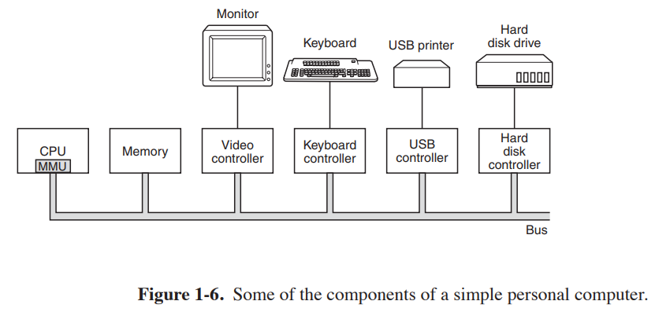

### 1.3.1 Prosesor
''Otak'' komputer adalah CPU. Itu mengambil instruksi dari memori
dan mengeksekusi mereka. Siklus dasar setiap CPU adalah mengambil instruksi pertama
dari memori, decode untuk menentukan jenis dan operandnya, jalankan, dan kemudian
mengambil, mendekode, dan menjalankan instruksi selanjutnya. Siklus tersebut diulangi sampai
program selesai. Dengan cara ini, program dilakukan.
Setiap CPU memiliki serangkaian instruksi khusus yang dapat dieksekusi. Jadi x86
prosesor tidak dapat menjalankan program ARM dan prosesor ARM tidak dapat mengeksekusi
program x86. Karena mengakses memori untuk mendapatkan instruksi atau kata data membutuhkan
lebih lama dari mengeksekusi instruksi, semua CPU berisi beberapa register di dalamnya
untuk menahan variabel kunci dan hasil sementara. Jadi set instruksi umumnya berisi instruksi untuk memuat kata dari memori ke dalam register, dan menyimpan kata
dari register ke memori. Instruksi lain menggabungkan dua operan dari register, memori, atau keduanya menjadi hasil, seperti menambahkan dua kata dan menyimpan hasilnya
dalam register atau memori.
Selain register umum yang digunakan untuk menyimpan variabel dan hasil sementara, kebanyakan komputer memiliki beberapa register khusus yang dapat dilihat oleh pemrogram. Salah satunya adalah program counter, yang berisi memori ad dress dari instruksi berikutnya yang akan diambil. Setelah instruksi itu diambil,
penghitung program diperbarui untuk menunjuk ke penggantinya.
Register lain adalah penunjuk tumpukan, yang menunjuk ke atas arus
menumpuk di memori. Tumpukan berisi satu frame untuk setiap prosedur yang telah
masuk tapi belum keluar. Kerangka tumpukan prosedur menyimpan parameter input tersebut,
variabel lokal, dan variabel sementara yang tidak disimpan dalam register.
Namun register lain adalah PSW (Program Status Word). Register ini berisi bit kode kondisi, yang diatur oleh instruksi perbandingan, CPU
prioritas, mode (pengguna atau kernel), dan berbagai bit kontrol lainnya. Program pengguna
biasanya dapat membaca seluruh PSW tetapi biasanya hanya dapat menulis beberapa bidangnya.
PSW memainkan peran penting dalam panggilan sistem dan I/O.
Sistem operasi harus sepenuhnya menyadari semua register. Ketika waktu mul memberi tip pada CPU, sistem operasi akan sering menghentikan program yang sedang berjalan untuk
(kembali) mulai yang lain. Setiap kali menghentikan program yang sedang berjalan, sistem operasi
harus menyimpan semua register agar dapat dipulihkan saat program berjalan nanti.
Untuk meningkatkan kinerja, desainer CPU telah lama meninggalkan yang sederhana
model pengambilan, decoding, dan eksekusi satu instruksi pada satu waktu. Banyak modern
CPU memiliki fasilitas untuk mengeksekusi lebih dari satu instruksi secara bersamaan. Untuk
misalnya, CPU mungkin memiliki unit pengambilan, dekode, dan eksekusi terpisah, sehingga saat
itu mengeksekusi instruksi n, bisa juga decoding instruksi n + 1 dan mengambil instruksi n + 2. Organisasi seperti itu disebut pipa dan diilustrasikan dalam
Gambar 1-7(a) untuk pipa dengan tiga tahap. Pipa yang lebih panjang adalah hal biasa. Di sebagian besar
desain pipa, setelah instruksi telah diambil ke dalam pipa, itu harus
dieksekusi, bahkan jika instruksi sebelumnya adalah cabang bersyarat yang diambil. Pipeline menyebabkan penulis kompiler dan penulis sistem operasi sakit kepala karena mereka mengekspos kompleksitas mesin yang mendasarinya kepada mereka dan mereka
harus berurusan dengan mereka.

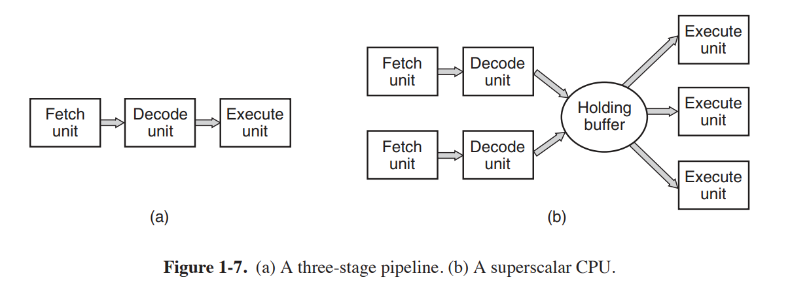

Bahkan lebih canggih dari desain pipa adalah CPU superscalar, ditunjukkan pada
Gambar 1-7(b). Dalam desain ini, beberapa unit eksekusi hadir, misalnya, satu
untuk aritmatika bilangan bulat, satu untuk aritmatika titik-mengambang, dan satu untuk operasi Boolean. Dua atau lebih instruksi diambil sekaligus, didekode, dan dibuang ke a
menahan buffer sampai dapat dieksekusi. Segera setelah unit eksekusi menjadi
tersedia, itu terlihat di buffer holding untuk melihat apakah ada instruksi yang dapat ditangani le, dan jika demikian, ia menghapus instruksi dari buffer dan mengeksekusinya. Implikasi dari desain ini adalah bahwa instruksi program sering kali dieksekusi secara tidak berurutan. Untuk
sebagian besar terserah perangkat keras untuk memastikan hasil yang dihasilkan sama
satu implementasi berurutan akan menghasilkan, tetapi jumlah yang mengganggu
kompleksitas dimasukkan ke sistem operasi, seperti yang akan kita lihat.
Sebagian besar CPU, kecuali yang sangat sederhana yang digunakan dalam sistem tertanam, memiliki dua
mode, mode kernel dan mode pengguna, seperti yang disebutkan sebelumnya. Biasanya, sedikit di PSW
mengontrol mode. Saat berjalan dalam mode kernel, CPU dapat mengeksekusi setiap instruksi dalam set instruksinya dan menggunakan setiap fitur perangkat keras. Di desktop
dan mesin server, sistem operasi biasanya berjalan dalam mode kernel, memberikannya
akses ke perangkat keras lengkap. Pada sebagian besar sistem tertanam, sebagian kecil berjalan
dalam mode kernel, dengan sistem operasi lainnya berjalan dalam mode pengguna.
Program pengguna selalu berjalan dalam mode pengguna, yang memungkinkan hanya sebagian dari instruksi yang akan dieksekusi dan sebagian fitur yang akan diakses. Umumnya semua
instruksi yang melibatkan I/O dan perlindungan memori tidak diizinkan dalam mode pengguna.
Mengatur bit mode PSW untuk masuk ke mode kernel juga dilarang, tentu saja.
Untuk mendapatkan layanan dari sistem operasi, program pengguna harus membuat panggilan sistem, yang menjebak ke dalam kernel dan memanggil sistem operasi. Jebakan
instruksi beralih dari mode pengguna ke mode kernel dan memulai sistem operasi. Ketika pekerjaan telah selesai, kontrol dikembalikan ke program pengguna di
instruksi setelah panggilan sistem. Kami akan menjelaskan detail sistemnya
mekanisme panggilan nanti dalam bab ini. Untuk saat ini, anggap itu sebagai jenis khusus panggilan prosedur yang memiliki properti tambahan untuk beralih dari mode pengguna ke
modus inti. Sebagai catatan tentang tipografi, kami akan menggunakan huruf kecil Helvetica font
untuk menunjukkan panggilan sistem dalam teks yang sedang berjalan, seperti ini: baca.
Perlu dicatat bahwa komputer memiliki jebakan selain instruksi untuk menjalankan panggilan sistem. Sebagian besar jebakan lain disebabkan oleh perangkat keras untuk memperingatkan
dari situasi luar biasa seperti upaya untuk membagi dengan 0 atau floating-point
arus bawah. Dalam semua kasus, sistem operasi mendapat kendali dan harus memutuskan apa yang harus
melakukan. Terkadang program harus dihentikan dengan kesalahan. Di lain waktu
kesalahan dapat diabaikan (angka underflow dapat diatur ke 0). Akhirnya, ketika
program telah mengumumkan sebelumnya bahwa ia ingin menangani jenis kondisi tertentu, kontrol dapat diteruskan kembali ke program untuk membiarkannya menangani masalah.
Chip Multithread dan Multicore
Hukum Moore menyatakan bahwa jumlah transistor pada sebuah chip berlipat ganda setiap 18
bulan. ''Hukum'' ini bukanlah semacam hukum fisika, seperti kekekalan momentum, tetapi merupakan pengamatan oleh salah satu pendiri Intel, Gordon Moore, tentang seberapa cepat insinyur proses di perusahaan semikonduktor mampu mengecilkan transistor mereka.
Hukum Moore telah berlaku selama lebih dari tiga dekade sekarang dan diperkirakan akan berlaku selama
setidaknya satu lagi. Setelah itu, jumlah atom per transistor akan menjadi terlalu
mekanika kecil dan kuantum akan mulai memainkan peran besar, mencegah lebih lanjut
penyusutan ukuran transistor.
Kelimpahan transistor menyebabkan masalah: apa yang harus dilakukan dengan semua
mereka? Kami melihat satu pendekatan di atas: arsitektur superscalar, dengan beberapa unit fungsional. Tetapi karena jumlah transistor meningkat, lebih banyak lagi yang mungkin. Satu
hal yang jelas untuk dilakukan adalah meletakkan cache yang lebih besar pada chip CPU. Itu pasti terjadi, tetapi pada akhirnya titik hasil yang semakin berkurang akan tercapai.
Langkah selanjutnya yang jelas adalah mereplikasi tidak hanya unit fungsional, tetapi juga
beberapa logika kontrol. Intel Pentium 4 memperkenalkan properti ini, yang disebut
multithreading atau hyperthreading (nama Intel untuk itu), ke prosesor x86, dan
beberapa chip CPU lainnya juga memilikinya—termasuk SPARC, Power5, Intel
Xeon, dan keluarga Intel Core. Untuk pendekatan pertama, apa yang dilakukannya adalah mengizinkan
CPU untuk menahan status dua utas yang berbeda dan kemudian beralih bolak-balik pada a
skala waktu nanodetik. (Utas adalah sejenis proses ringan, yang, pada gilirannya,
adalah program yang sedang berjalan; kita akan masuk ke rincian di Chap. 2.) Misalnya, jika salah satu
proses perlu membaca kata dari memori (yang membutuhkan banyak jam
siklus), CPU multithreaded hanya dapat beralih ke thread lain. Multithreading
tidak menawarkan paralelisme sejati. Hanya satu proses pada satu waktu yang berjalan, tapi
waktu thread-switching berkurang ke urutan nanodetik.
Multithreading memiliki implikasi untuk sistem operasi karena setiap thread
muncul ke sistem operasi sebagai CPU terpisah. Pertimbangkan sistem dengan dua
CPU sebenarnya, masing-masing dengan dua utas. Sistem operasi akan melihat ini sebagai empat
CPU. Jika hanya ada cukup pekerjaan untuk membuat dua CPU sibuk pada titik tertentu di waktu, mungkin secara tidak sengaja menjadwalkan dua utas pada CPU yang sama, dengan yang lain
CPU benar-benar menganggur. Pilihan ini jauh kurang efisien daripada menggunakan satu utas pada masing-masing
CPU.
Selain multithreading, banyak chip CPU sekarang memiliki empat, delapan, atau lebih prosesor atau inti lengkap. Chip multicore pada Gambar 1-8 secara efektif membawa
empat minichip di dalamnya, masing-masing dengan CPU independennya sendiri. (Cache akan menjadi
dijelaskan di bawah ini.) Beberapa prosesor, seperti Intel Xeon Phi dan Tilera TilePro, sudah siap menjalankan lebih dari 60 core dalam satu chip. Memanfaatkan multicore seperti itu
chip pasti akan membutuhkan sistem operasi multiprosesor.
Kebetulan, dalam hal jumlah, tidak ada yang mengalahkan GPU modern (Graph ics Processing Unit). GPU adalah prosesor dengan, secara harfiah, ribuan inti kecil.
Mereka sangat bagus untuk banyak perhitungan kecil yang dilakukan secara paralel, seperti rendering
poligon dalam aplikasi grafis. Mereka tidak begitu baik dalam tugas-tugas serial. Mereka
juga sulit untuk diprogram. Meskipun GPU dapat berguna untuk sistem operasi (mis., enkripsi atau pemrosesan lalu lintas jaringan), tidak mungkin sebagian besar operasi
sistem itu sendiri akan berjalan di GPU.

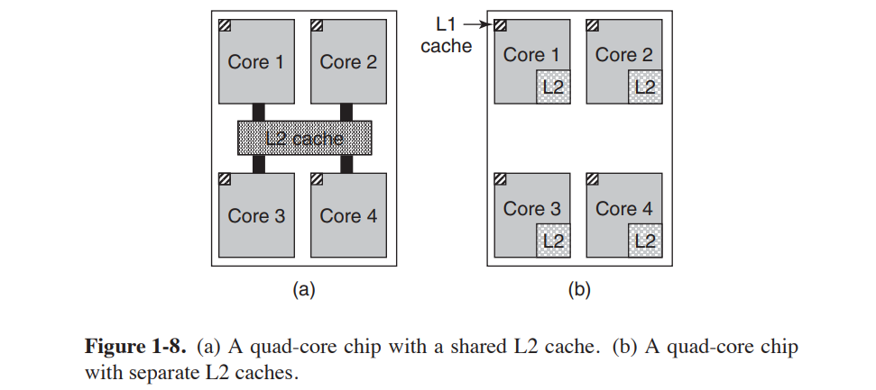

### 1.3.2 Memori
Komponen utama kedua di komputer manapun adalah memori. Idealnya, memori harus sangat cepat (lebih cepat daripada mengeksekusi instruksi sehingga CPU dapat
tidak tertahan oleh memori), sangat besar, dan sangat murah. Tidak ada teknologi saat ini yang memenuhi semua tujuan ini, sehingga diambil pendekatan yang berbeda. Sistem memori dibangun sebagai hierarki lapisan, seperti yang ditunjukkan pada Gambar 1-9. Lapisan atas
memiliki kecepatan lebih tinggi, kapasitas lebih kecil, dan biaya per bit lebih besar daripada yang lebih rendah,
sering kali dengan faktor satu miliar atau lebih.
Lapisan atas terdiri dari register internal ke CPU. Mereka terbuat dari
bahan yang sama dengan CPU dan dengan demikian secepat CPU. Akibatnya,
tidak ada penundaan dalam mengaksesnya. Kapasitas penyimpanan yang tersedia di dalamnya adalah

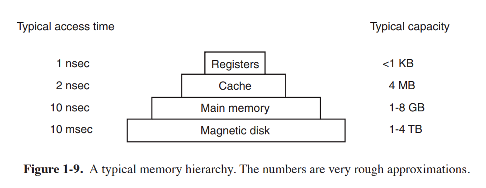

biasanya 32 × 32 bit pada CPU 32-bit dan 64 × 64 bit pada CPU 64-bit. Kurang dari
1 KB dalam kedua kasus. Program harus mengelola register (yaitu, memutuskan apa yang harus disimpan
di dalamnya) sendiri, dalam perangkat lunak.
Berikutnya adalah memori cache, yang sebagian besar dikendalikan oleh perangkat keras.
Memori utama dibagi menjadi baris cache, biasanya 64 byte, dengan alamat 0
ke 63 di baris cache 0, 64 hingga 127 di cache baris 1, dan seterusnya. Yang paling banyak digunakan
baris cache disimpan dalam cache berkecepatan tinggi yang terletak di dalam atau sangat dekat dengan CPU.
Ketika program perlu membaca kata memori, perangkat keras cache memeriksa untuk melihat
jika baris yang dibutuhkan ada di cache. Jika ya, disebut cache hit, permintaannya terpenuhi
dari cache dan tidak ada permintaan memori yang dikirim melalui bus ke memori utama.
Cache hits biasanya memakan waktu sekitar dua siklus clock. Cache rindu harus pergi ke
memori, dengan hukuman waktu yang substansial. Memori cache terbatas ukurannya karena
harga tinggi. Beberapa mesin memiliki dua atau bahkan tiga tingkat cache, masing-masing lebih lambat
dan lebih besar dari yang sebelumnya.
Caching memainkan peran utama dalam banyak bidang ilmu komputer, bukan hanya caching
baris RAM. Setiap kali sumber daya dapat dibagi menjadi beberapa bagian, beberapa di antaranya adalah
digunakan jauh lebih banyak daripada yang lain, caching sering digunakan untuk meningkatkan kinerja. Sistem operasi menggunakannya sepanjang waktu. Misalnya, sebagian besar sistem operasi
simpan (potongan) file yang banyak digunakan di memori utama untuk menghindari keharusan mengambilnya
dari disk berulang kali. Demikian pula, hasil konversi nama jalur panjang seperti
/home/ast/projects/minix3/src/kernel/clock.c
ke alamat disk tempat file berada dapat di-cache untuk menghindari pengulangan
pencarian. Akhirnya, ketika alamat halaman Web (URL) dikonversi ke jaringan
address (alamat IP), hasilnya dapat di-cache untuk digunakan di masa mendatang. Banyak kegunaan lain yang ada.
Dalam sistem caching apa pun, beberapa pertanyaan segera muncul, termasuk:
1. Kapan harus memasukkan item baru ke dalam cache.
2. Baris cache mana untuk memasukkan item baru.
3. Item mana yang harus dihapus dari cache saat slot diperlukan.
4. Tempat meletakkan item yang baru dikeluarkan di memori yang lebih besar. 

Tidak setiap pertanyaan relevan dengan setiap situasi caching. Untuk caching baris main
memori dalam cache CPU, item baru umumnya akan dimasukkan pada setiap cache
merindukan. Garis cache yang digunakan umumnya dihitung dengan menggunakan beberapa perintah tingkat tinggi
bit alamat memori yang dirujuk. Misalnya, dengan 4096 baris cache 64
byte dan alamat 32 bit, bit 6 hingga 17 dapat digunakan untuk menentukan cache
baris, dengan bit 0 sampai 5 byte dalam baris cache. Dalam hal ini, item yang akan dihapus
sama dengan data baru yang masuk, tetapi di sistem lain mungkin tidak.
Akhirnya, ketika baris cache ditulis ulang ke memori utama (jika telah dimodifikasi
sejak di-cache), tempat di memori untuk menulis ulang ditentukan secara unik oleh
alamat yang dimaksud.
Cache adalah ide yang bagus sehingga CPU modern memiliki dua di antaranya. Pertama
cache level atau L1 selalu berada di dalam CPU dan biasanya memberikan instruksi yang didekodekan
ke mesin eksekusi CPU. Sebagian besar chip memiliki cache L1 kedua dengan harga yang sangat
kata-kata data yang banyak digunakan. Cache L1 biasanya masing-masing 16 KB. Sebagai tambahan,
sering ada cache kedua, yang disebut cache L2, yang menampung beberapa megabita
kata-kata memori yang baru-baru ini digunakan. Perbedaan antara cache L1 dan L2 terletak pada
waktunya. Akses ke cache L1 dilakukan tanpa penundaan, sedangkan akses ke
cache L2 melibatkan penundaan satu atau dua siklus clock.
Pada chip multicore, perancang harus memutuskan di mana menempatkan cache. Di
Gambar 1-8(a), satu cache L2 digunakan bersama oleh semua inti. Pendekatan ini digunakan dalam
Chip multicore Intel. Sebaliknya, pada Gambar 1-8(b), setiap inti memiliki cache L2 sendiri.
Pendekatan ini digunakan oleh AMD. Setiap strategi memiliki pro dan kontra. Sebagai contoh,
cache L2 bersama Intel membutuhkan pengontrol cache yang lebih rumit tetapi
Cara AMD membuat cache L2 tetap konsisten menjadi lebih sulit.
Memori utama muncul berikutnya dalam hierarki Gambar 1-9. Ini adalah pekerja keras
dari sistem memori. Memori utama biasanya disebut RAM (Random Access)
Penyimpanan). Orang tua terkadang menyebutnya memori inti, karena komputer di
1950-an dan 1960-an menggunakan inti ferit kecil yang dapat dimagnetisasi untuk memori utama. Mereka memiliki
telah hilang selama beberapa dekade tetapi namanya tetap ada. Saat ini, kenangan adalah ratusan
megabyte hingga beberapa gigabyte dan berkembang pesat. Semua permintaan CPU yang tidak bisa
puas keluar dari cache pergi ke memori utama.
Selain memori utama, banyak komputer memiliki sejumlah kecil memori akses acak yang tidak mudah menguap. Tidak seperti RAM, memori nonvolatile tidak hilang
isinya saat listrik dimatikan. ROM (Memori Hanya Baca) diprogram di pabrik dan tidak dapat diubah setelahnya. Ini cepat dan murah. Pada beberapa komputer, bootstrap loader yang digunakan untuk memulai komputer terdapat dalam ROM. Juga, beberapa kartu I/O dilengkapi dengan ROM untuk menangani kontrol perangkat tingkat rendah.
EEPROM (Electrically Erasable PROM) dan memori flash juga bersifat non volatile, namun berbeda dengan ROM yang dapat dihapus dan ditulis ulang. Namun, menulis
mereka membutuhkan waktu lebih lama daripada menulis RAM, jadi mereka digunakan dalam
ROM dengan cara yang sama, hanya dengan fitur tambahan yang sekarang dimungkinkan untuk
memperbaiki bug dalam program yang mereka pegang dengan menulis ulang di lapangan.
Flash memory juga biasa digunakan sebagai media penyimpanan pada perangkat elektronik portabel. Ini berfungsi sebagai film di kamera digital dan sebagai disk dalam musik portabel
pemain, untuk menyebutkan hanya dua kegunaan. Memori flash memiliki kecepatan menengah antara
RAM dan disk. Juga, tidak seperti memori disk, jika terlalu sering dihapus, itu akan aus
keluar.
Namun jenis memori lain adalah CMOS, yang tidak stabil. Banyak komputer menggunakan
Memori CMOS untuk menyimpan waktu dan tanggal saat ini. Memori CMOS dan
rangkaian jam yang menambah waktu di dalamnya ditenagai oleh baterai kecil, jadi
waktu diperbarui dengan benar, bahkan ketika komputer dicabut. Memori CMOS juga dapat menyimpan parameter konfigurasi, seperti disk mana yang akan di-boot.
CMOS digunakan karena menggunakan daya yang sangat kecil sehingga yang dipasang di pabrik asli
baterai sering berlangsung selama beberapa tahun. Namun, ketika mulai gagal, komputer
tampaknya memiliki penyakit Alzheimer, melupakan hal-hal yang telah diketahuinya
tahun, seperti hard disk mana untuk boot.
### 1.3.3 Disk
Berikutnya dalam hirarki adalah magnetic disk (hard disk). Penyimpanan disk adalah dua pesanan
besarnya lebih murah daripada RAM per bit dan seringkali dua kali lipat lebih besar
demikian juga. Satu-satunya masalah adalah waktu untuk mengakses data secara acak di dekat
tiga kali lipat lebih lambat. Alasannya adalah bahwa disk adalah perangkat mekanis,
seperti yang ditunjukkan pada Gambar 1-10.

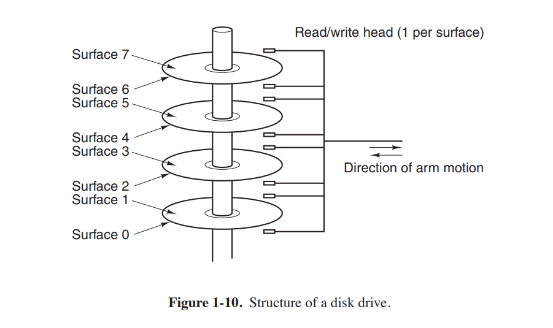

Sebuah piringan terdiri dari satu atau lebih pelat logam yang berputar pada 5400, 7200, 10,800
RPM atau lebih. Lengan mekanis berputar di atas piring-piring dari sudut, serupa
ke lengan pickup pada fonograf 33-RPM tua untuk memutar piringan hitam.

Informasi ditulis ke disk dalam serangkaian lingkaran konsentris. Kapan saja
posisi lengan, masing-masing kepala dapat membaca daerah annular yang disebut trek. Untuk mendapatkannya, semua trek untuk posisi lengan tertentu membentuk silinder.
Setiap trek dibagi menjadi beberapa sektor, biasanya 512 byte per detik. Pada disk modern, silinder luar berisi lebih banyak sektor daripada yang dalam.
Memindahkan lengan dari satu silinder ke silinder berikutnya membutuhkan waktu sekitar 1 mdtk. Memindahkannya ke
silinder acak biasanya membutuhkan waktu 5 sampai 10 msec, tergantung pada drive. sekali
lengan berada di jalur yang benar, drive harus menunggu sektor yang diperlukan berputar di bawah
kepala, penundaan tambahan dari 5 mdtk hingga 10 mdtk, tergantung pada RPM drive.
Setelah sektor berada di bawah kepala, membaca atau menulis terjadi pada kecepatan 50 MB/dtk
pada disk kelas bawah hingga 160 MB/detik pada disk yang lebih cepat.
Terkadang Anda akan mendengar orang berbicara tentang disk yang sebenarnya bukan disk sama sekali,
seperti SSD, (Solid State Disk). SSD tidak memiliki bagian yang bergerak, tidak mengandung
piring-piring dalam bentuk disk, dan menyimpan data dalam memori (Flash). Satu-satunya cara masuk
yang menyerupai disk adalah mereka juga menyimpan banyak data yang tidak hilang
saat listrik mati.
Banyak komputer mendukung skema yang dikenal sebagai memori virtual, yang akan kita
membahas panjang lebar di Bab. 3. Skema ini memungkinkan untuk menjalankan program
lebih besar dari memori fisik dengan menempatkannya pada disk dan menggunakan memori utama
sebagai semacam cache untuk bagian yang paling banyak dieksekusi. Skema ini membutuhkan pemetaan ulang alamat memori dengan cepat untuk mengubah alamat program yang dihasilkan ke alamat fisik di RAM tempat kata berada. pemetaan ini adalah
dilakukan oleh bagian dari CPU yang disebut MMU (Memory Management Unit), sebagai
ditunjukkan pada Gambar. 1-6.
Kehadiran caching dan MMU dapat berdampak besar pada kinerja. Dalam sistem multiprogramming, ketika beralih dari satu program ke
lain, kadang-kadang disebut sakelar konteks, mungkin perlu untuk menghapus semua blok yang dimodifikasi dari cache dan mengubah register pemetaan di MMU. Keduanya
ini adalah operasi yang mahal, dan pemrogram berusaha keras untuk menghindarinya. Kami akan
lihat beberapa implikasi dari taktik mereka nanti.
### 1.3.4 Perangkat I/O
CPU dan memori bukan satu-satunya sumber daya yang dimiliki sistem operasi
harus mengelola. Perangkat I/O juga banyak berinteraksi dengan sistem operasi. Seperti yang kita
dilihat pada Gambar 1-6, perangkat I/O umumnya terdiri dari dua bagian: pengontrol dan perangkat itu sendiri. Controller adalah sebuah chip atau satu set chip yang secara fisik mengontrol perangkat. Ia menerima perintah dari sistem operasi, misalnya, untuk membaca data
dari perangkat, dan melaksanakannya.
Dalam banyak kasus, kontrol perangkat yang sebenarnya rumit dan terperinci, jadi
itu adalah tugas pengontrol untuk menghadirkan antarmuka yang lebih sederhana (tetapi masih sangat kompleks)
ke sistem operasi. Misalnya, pengontrol disk mungkin menerima perintah untuk baca sektor 11.206 dari disk 2. Pengontrol kemudian harus mengubah sektor linier ini
nomor ke silinder, sektor, dan kepala. Konversi ini mungkin rumit oleh
fakta bahwa silinder luar memiliki lebih banyak sektor daripada yang dalam dan bahwa beberapa sektor buruk telah dipetakan kembali ke yang lain. Kemudian pengontrol harus menentukan
silinder mana lengan disk berada dan berikan perintah untuk bergerak masuk atau keluar jumlah silinder yang diperlukan. Itu harus menunggu sampai sektor yang tepat diputar di bawah
kepala dan kemudian mulai membaca dan menyimpan bit saat keluar dari drive,
menghapus pembukaan dan menghitung checksum. Akhirnya, itu harus dirakit
bit yang masuk ke dalam kata-kata dan menyimpannya dalam memori. Untuk melakukan semua pekerjaan ini, pengontrol sering kali berisi komputer kecil yang disematkan yang diprogram untuk melakukannya
kerja.
Bagian lainnya adalah perangkat itu sendiri. Perangkat memiliki antarmuka yang cukup sederhana, baik karena tidak dapat berbuat banyak maupun untuk menjadikannya standar. Yang terakhir adalah
diperlukan agar setiap pengontrol disk SAT A dapat menangani disk SAT A, misalnya.
SATA adalah singkatan dari Serial ATA dan AT A pada gilirannya adalah singkatan dari AT Attachment. Dalam hal
Anda ingin tahu apa singkatan dari AT, ini adalah generasi kedua IBM '' Pribadi
Teknologi Canggih Komputer '' dibangun di sekitar 6-MHz yang sangat kuat saat itu
Prosesor 80286 yang diperkenalkan perusahaan pada tahun 1984. Apa yang kami pelajari dari ini adalah
bahwa industri komputer memiliki kebiasaan untuk terus menyempurnakan akronim yang ada dengan awalan dan akhiran baru. Kami juga belajar bahwa kata sifat seperti ''ad vanced'' harus digunakan dengan sangat hati-hati, atau Anda akan terlihat konyol tiga puluh tahun ke depan.
garis.
SATA saat ini merupakan jenis disk standar di banyak komputer. Karena antarmuka perangkat yang sebenarnya tersembunyi di balik pengontrol, semua itu adalah sistem operasi
melihat adalah antarmuka ke pengontrol, yang mungkin sangat berbeda dari antarmuka ke perangkat.
Karena setiap jenis pengontrol berbeda, perangkat lunak yang berbeda diperlukan untuk
mengontrol masing-masing. Perangkat lunak yang berbicara dengan pengontrol, memberinya perintah dan
menerima tanggapan, disebut driver perangkat. Setiap produsen pengontrol harus
menyediakan driver untuk setiap sistem operasi yang didukungnya. Jadi pemindai mungkin datang
dengan driver untuk OS X, Windows 7, Windows 8, dan Linux, misalnya.
Untuk menggunakannya, driver harus dimasukkan ke dalam sistem operasi agar dapat berjalan di
modus inti. Driver benar-benar dapat berjalan di luar kernel, dan sistem operasi
seperti Linux dan Windows saat ini menawarkan beberapa dukungan untuk melakukannya. Yang luas
sebagian besar driver masih berjalan di bawah batas kernel. Hanya sangat sedikit saat ini
sistem, seperti MINIX 3, menjalankan semua driver di ruang pengguna. Pengemudi di ruang pengguna harus
diizinkan untuk mengakses perangkat dengan cara yang terkontrol, yang tidak mudah.
Ada tiga cara driver dapat dimasukkan ke dalam kernel. Cara pertama adalah
hubungkan kembali kernel dengan driver baru dan kemudian reboot sistem. Banyak UNIX yang lebih tua
sistem bekerja seperti ini. Cara kedua adalah membuat entri di sistem operasi
file yang mengatakan bahwa itu membutuhkan driver dan kemudian reboot sistem. Pada saat booting,
sistem operasi berjalan dan menemukan driver yang dibutuhkan dan memuatnya. jendela
bekerja dengan cara ini. Cara ketiga adalah agar sistem operasi dapat menerima yang baru driver saat menjalankan dan menginstalnya dengan cepat tanpa perlu reboot. Ini
cara yang dulunya jarang tetapi sekarang menjadi jauh lebih umum. Hot-pluggable
perangkat, seperti perangkat USB dan IEEE 1394 (dibahas di bawah), selalu membutuhkan driver yang dimuat secara dinamis.
Setiap pengontrol memiliki sejumlah kecil register yang digunakan untuk berkomunikasi
dengan itu. Misalnya, pengontrol disk minimal mungkin memiliki register untuk menentukan
alamat disk, alamat memori, jumlah sektor, dan arah (baca atau tulis). Ke
aktifkan pengontrol, pengemudi mendapat perintah dari sistem operasi, lalu
menerjemahkannya ke dalam nilai yang sesuai untuk ditulis ke dalam register perangkat. Koleksi semua register perangkat membentuk ruang port I/O, topik yang akan kita bahas
kembali ke dalam Bab. 5.
Pada beberapa komputer, register perangkat dipetakan ke dalam ruang alamat sistem operasi (alamat yang dapat digunakan), sehingga dapat dibaca dan ditulis seperti
kata-kata memori biasa. Pada komputer seperti itu, tidak diperlukan instruksi I/O khusus dan program pengguna dapat dijauhkan dari perangkat keras dengan tidak meletakkannya
alamat memori dalam jangkauan mereka (misalnya, dengan menggunakan register dasar dan batas). Pada
komputer lain, register perangkat diletakkan di ruang port I/O khusus, dengan masing-masing
mendaftar memiliki alamat port. Pada mesin ini, instruksi IN dan OUT khusus
tersedia dalam mode kernel untuk memungkinkan driver membaca dan menulis register. Itu
skema sebelumnya menghilangkan kebutuhan untuk instruksi I/O khusus tetapi menggunakan beberapa dari
ruang alamat. Yang terakhir tidak menggunakan ruang alamat tetapi membutuhkan instruksi khusus. Kedua sistem ini banyak digunakan.
Input dan output dapat dilakukan dengan tiga cara berbeda. Dalam metode yang paling sederhana,
program pengguna mengeluarkan panggilan sistem, yang kemudian diterjemahkan oleh kernel ke dalam prosedur
hubungi pengemudi yang sesuai. Pengemudi kemudian memulai I/O dan duduk dalam lingkaran yang ketat
terus melakukan polling perangkat untuk melihat apakah sudah selesai (biasanya ada beberapa bit yang menunjukkan bahwa perangkat masih sibuk). Ketika I/O telah selesai, driver menempatkan
data (jika ada) di mana mereka dibutuhkan dan dikembalikan. Sistem operasi kemudian mengembalikan kontrol ke pemanggil. Metode ini disebut sibuk menunggu dan memiliki keuntungan mengikat CPU polling perangkat sampai selesai.
Metode kedua adalah driver untuk memulai perangkat dan memintanya untuk memberikan interupsi ketika selesai. Pada saat itu pengemudi kembali. Sistem operasi
kemudian memblokir penelepon jika perlu dan mencari pekerjaan lain yang harus dilakukan. Ketika pengontrol mendeteksi akhir transfer, itu menghasilkan interupsi untuk menyelesaikan sinyal.
Interupsi sangat penting dalam sistem operasi, jadi mari kita periksa idenya
lebih dekat. Pada Gambar 1-11(a) kita melihat proses tiga langkah untuk I/O. Pada langkah 1,
driver memberi tahu pengontrol apa yang harus dilakukan dengan menulis ke register perangkatnya. Pengendali kemudian memulai perangkat. Ketika pengontrol selesai membaca atau menulis
jumlah byte yang telah diperintahkan untuk ditransfer, itu menandakan pengontrol interupsi
chip menggunakan jalur bus tertentu pada langkah 2. Jika pengontrol interupsi siap menerima
interupsi (yang mungkin tidak jika sedang sibuk menangani yang berprioritas lebih tinggi), ia memberikan pin pada chip CPU yang memberitahukannya, pada langkah 3. Pada langkah 4, pengontrol interupsi menempatkan nomor perangkat di bus sehingga CPU dapat membacanya dan mengetahui yang mana
perangkat baru saja selesai (banyak perangkat mungkin berjalan pada waktu yang sama).

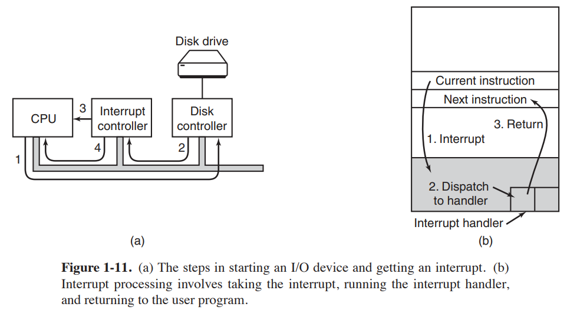

Setelah CPU memutuskan untuk mengambil interupsi, penghitung program dan PSW
biasanya kemudian didorong ke tumpukan saat ini dan CPU beralih ke kernel
mode. Nomor perangkat dapat digunakan sebagai indeks ke bagian memori untuk menemukan
alamat pengendali interupsi untuk perangkat ini. Bagian memori ini disebut
vektor interupsi. Setelah penangan interupsi (bagian dari driver untuk interupsi
perangkat) telah dimulai, akan menghapus penghitung program yang ditumpuk dan PSW dan menyimpan
mereka, lalu menanyakan perangkat untuk mempelajari statusnya. Ketika pawang sudah selesai, itu
kembali ke program pengguna yang berjalan sebelumnya ke instruksi pertama yang tidak
belum dieksekusi. Langkah-langkah ini ditunjukkan pada Gambar 1-11(b).
Metode ketiga untuk melakukan I/O menggunakan perangkat keras khusus: DMA
(Direct Memory Access) chip yang dapat mengontrol aliran bit antar memori
dan beberapa pengontrol tanpa intervensi CPU yang konstan. CPU mengatur
Chip DMA, memberi tahu berapa banyak byte yang akan ditransfer, perangkat dan alamat memori
terlibat, dan arahnya, dan membiarkannya pergi. Ketika chip DMA selesai, itu menyebabkan
interupsi, yang ditangani seperti dijelaskan di atas. DMA dan perangkat keras I/O secara umum akan dibahas lebih rinci pada Bab. 5.
Interupsi dapat (dan sering terjadi) terjadi pada saat-saat yang sangat tidak nyaman, misalnya, saat penangan interupsi lain sedang berjalan. Untuk alasan ini, CPU memiliki
cara untuk menonaktifkan interupsi dan kemudian mengaktifkannya kembali nanti. Saat interupsi dinonaktifkan, perangkat apa pun yang selesai melanjutkan untuk menegaskan sinyal interupsinya, tetapi CPU
tidak terputus sampai interupsi diaktifkan kembali. Jika beberapa perangkat selesai
saat interupsi dinonaktifkan, pengontrol interupsi memutuskan mana yang akan dibiarkan
melalui pertama, biasanya berdasarkan prioritas statis yang ditetapkan untuk setiap perangkat. Itu
perangkat dengan prioritas tertinggi menang dan akan diservis terlebih dahulu. Yang lain harus menunggu.
### 1.3.5 Bus
Organisasi Gambar 1-6 digunakan pada komputer mini selama bertahun-tahun dan juga pada
PC IBM asli. Namun, karena prosesor dan memori menjadi lebih cepat, kemampuan
dari satu bus (dan tentu saja bus IBM PC) untuk menangani semua lalu lintas tegang
ke titik putus. Sesuatu harus diberikan. Akibatnya, bus tambahan adalah
ditambahkan, baik untuk perangkat I/O yang lebih cepat dan untuk lalu lintas CPU-ke-memori. Sebagai konsekuensi dari evolusi ini, sistem x86 besar saat ini terlihat seperti
Gambar 1-12.

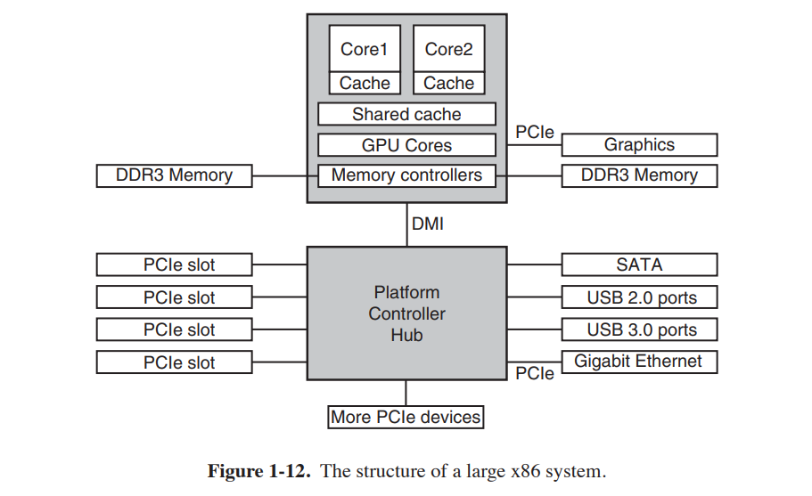

Sistem ini memiliki banyak bus (misalnya, cache, memori, PCIe, PCI, USB, SATA, dan
DMI), masing-masing dengan kecepatan transfer dan fungsi yang berbeda. Sistem operasi harus
waspadai semuanya untuk konfigurasi dan manajemen. Bus utama adalah
Bus PCIe (Peripheral Component Interconnect Express).
Bus PCIe ditemukan oleh Intel sebagai penerus bus PCI yang lebih tua, yang
pada gilirannya merupakan pengganti ISA asli (Arsitektur Standar Industri)
bis. Mampu mentransfer puluhan gigabit per detik, PCIe jauh lebih cepat daripada
para pendahulunya. Sifatnya juga sangat berbeda. Hingga pembuatannya pada tahun 2004, sebagian besar
bus paralel dan dibagi. Arsitektur bus bersama berarti bahwa beberapa perangkat menggunakan kabel yang sama untuk mentransfer data. Jadi, ketika beberapa perangkat memiliki data untuk
send, Anda memerlukan seorang arbiter untuk menentukan siapa yang dapat menggunakan bus. Sebaliknya, PCIe
memanfaatkan koneksi point-to-point khusus. Arsitektur bus paralel sebagai
digunakan dalam PCI tradisional berarti Anda mengirim setiap kata data melalui beberapa kabel.
Misalnya, dalam bus PCI biasa, satu nomor 32-bit dikirim melalui 32 paralel
kabel. Berbeda dengan ini, PCIe menggunakan arsitektur bus serial dan mengirimkan semua bit dalam pesan melalui satu koneksi, yang dikenal sebagai jalur, seperti jaringan
paket. Ini jauh lebih sederhana, karena Anda tidak harus memastikan bahwa semua 32 bit
tiba di tempat tujuan pada waktu yang sama. Paralelisme masih digunakan, karena
Anda dapat memiliki beberapa jalur secara paralel. Misalnya, kami dapat menggunakan 32 jalur untuk membawa
32 pesan secara paralel. Seperti kecepatan perangkat periferal seperti kartu jaringan dan
adapter grafis meningkat pesat, standar PCIe ditingkatkan setiap 3-5 tahun.
Misalnya, 16 jalur PCIe 2.0 menawarkan 64 gigabit per detik. Memutakhirkan ke PCIe
3.0 akan memberi Anda kecepatan dua kali lipat dan PCIe 4.0 akan menggandakannya lagi.
Sementara itu, kami masih memiliki banyak perangkat lama untuk standar PCI yang lebih lama. Sebagai
kita lihat pada Gambar 1-12, perangkat ini terhubung ke prosesor hub yang terpisah. Di
masa depan, ketika kita menganggap PCI tidak lagi hanya tua, tetapi kuno, itu mungkin
bahwa semua perangkat PCI akan dilampirkan ke hub lain yang pada gilirannya menghubungkannya ke
hub utama, membuat pohon bus.
Dalam konfigurasi ini, CPU berbicara ke memori melalui bus DDR3 cepat, ke perangkat grafis eksternal melalui PCIe dan ke semua perangkat lain melalui hub melalui DMI.
(Antarmuka Media Langsung) bus. Hub pada gilirannya menghubungkan semua perangkat lain,
menggunakan Universal Serial Bus untuk berbicara dengan perangkat USB, bus SATA untuk berinteraksi
dengan hard disk dan drive DVD, dan PCIe untuk mentransfer frame Ethernet. Kami telah menyebutkan perangkat PCI lama yang menggunakan bus PCI tradisional.
Selain itu, masing-masing inti memiliki cache khusus dan cache yang jauh lebih besar yang
dibagi di antara mereka. Masing-masing cache ini memperkenalkan bus lain.
USB (Universal Serial Bus) diciptakan untuk menghubungkan semua perangkat I/O yang lambat, seperti keyboard dan mouse, ke komputer. Namun, memanggil perangkat USB 3.0 modern yang berdengung pada 5 Gbps '' lambat '' mungkin tidak datang secara alami untuk
generasi yang tumbuh dengan ISA 8-Mbps sebagai bus utama di PC IBM pertama.
USB menggunakan konektor kecil dengan empat hingga sebelas kabel (tergantung versinya),
beberapa di antaranya memasok daya listrik ke perangkat USB atau terhubung ke ground.
USB adalah bus terpusat di mana perangkat root melakukan polling semua perangkat I/O setiap 1
msec untuk melihat apakah mereka memiliki lalu lintas. USB 1.0 dapat menangani beban agregat 12
Mbps, USB 2.0 meningkatkan kecepatan menjadi 480 Mbps, dan USB 3.0 mencapai tidak kurang dari
5 Gbps. Perangkat USB apa pun dapat dihubungkan ke komputer dan akan segera berfungsi, tanpa memerlukan reboot, sesuatu yang diperlukan perangkat pra-USB, banyak
untuk kekhawatiran generasi pengguna frustrasi.
Bus SCSI (Small Computer System Interface) adalah bus berkinerja tinggi
ditujukan untuk disk cepat, pemindai, dan perangkat lain yang membutuhkan lebar pita yang cukup besar. Saat ini, kami menemukan mereka sebagian besar di server dan workstation. Mereka bisa lari
hingga 640 MB/detik.
Untuk bekerja di lingkungan seperti Gambar 1-12, sistem operasi memiliki:
untuk mengetahui perangkat periferal apa yang terhubung ke komputer dan mengkonfigurasi
mereka. Persyaratan ini mendorong Intel dan Microsoft untuk merancang sistem PC yang disebut plug
dan bermain, berdasarkan konsep serupa yang pertama kali diterapkan di Apple Macintosh.
Sebelum plug and play, setiap kartu I/O memiliki tingkat permintaan interupsi tetap dan gaun iklan tetap untuk register I/O-nya. Misalnya, keyboard interupsi 1 dan digunakan Alamat I/O 0x60 hingga 0x64, pengontrol floppy disk diinterupsi 6 dan menggunakan I/O
alamat 0x3F0 hingga 0x3F7, dan printer diinterupsi 7 dan menggunakan alamat I/O
0x378 hingga 0x37A, dan seterusnya.
Sejauh ini bagus. Masalah datang ketika pengguna membeli kartu suara dan
kartu modem dan keduanya kebetulan menggunakan, katakanlah, interupsi 4. Mereka akan konflik dan
tidak akan bekerja sama. Solusinya adalah dengan memasukkan sakelar atau jumper DIP
setiap kartu I/O dan menginstruksikan pengguna untuk menyetelnya untuk memilih tingkat interupsi
dan alamat perangkat I/O yang tidak bertentangan dengan yang lain di sistem pengguna.
Remaja yang mengabdikan hidup mereka untuk kerumitan perangkat keras PC bisa
terkadang melakukan ini tanpa membuat kesalahan. Sayangnya, tidak ada orang lain yang bisa, menyebabkan kekacauan.
Apa yang dilakukan plug and play adalah membuat sistem secara otomatis mengumpulkan informasi
tentang perangkat I/O, menetapkan tingkat interupsi dan alamat I/O secara terpusat, dan kemudian
beri tahu setiap kartu berapa nomornya. Pekerjaan ini terkait erat dengan booting
komputer, jadi mari kita lihat itu. Hal ini tidak sepenuhnya sepele.
### 1.3.6 Mem-boot Komputer
Secara singkat, proses booting adalah sebagai berikut. Setiap PC berisi papan induk
(sebelumnya disebut motherboard sebelum kebenaran politik menghantam industri komputer). Di papan induk adalah program yang disebut sistem BIOS (Basic Input Out put System). BIOS berisi perangkat lunak I/O tingkat rendah, termasuk prosedur untuk:
membaca keyboard, menulis ke layar, dan melakukan disk I/O, antara lain. Sekarang ada, itu disimpan dalam flash RAM, yang nonvolatile tetapi dapat diperbarui oleh
sistem operasi ketika bug ditemukan di BIOS.
Ketika komputer di-boot, BIOS dimulai. Ini pertama kali memeriksa untuk melihat caranya
banyak RAM yang terpasang dan apakah keyboard dan perangkat dasar lainnya macet dan merespons dengan benar. Ini dimulai dengan memindai bus PCIe dan PCI
untuk mendeteksi semua perangkat yang terpasang padanya. Jika perangkat yang ada berbeda dari
ketika sistem terakhir kali di-boot, perangkat baru dikonfigurasi.
BIOS kemudian menentukan perangkat boot dengan mencoba daftar perangkat yang disimpan di
memori CMOS. Pengguna dapat mengubah daftar ini dengan memasukkan konfigurasi BIOS
program setelah boot. Biasanya, upaya dilakukan untuk boot dari CD-ROM
(atau terkadang USB), jika ada. Jika gagal, sistem melakukan boot dari
harddisk. Sektor pertama dari perangkat boot dibaca ke dalam memori dan dieksekusi.
Sektor ini berisi program yang biasanya memeriksa tabel partisi di
akhir sektor boot untuk menentukan partisi mana yang aktif. Kemudian boot sekunder
loader dibaca dari partisi itu. Loader ini membaca di sistem operasi
dari partisi aktif dan memulainya.
Sistem operasi kemudian menanyakan BIOS untuk mendapatkan informasi konfigurasi. Untuk setiap perangkat, ia akan memeriksa apakah ia memiliki driver perangkat. Jika tidak, ia bertanya
pengguna untuk memasukkan CD-ROM yang berisi driver (disediakan oleh pabrik pembuat perangkat) atau untuk mengunduhnya dari Internet. Setelah memiliki semua driver perangkat,sistem operasi memuatnya ke dalam kernel. Kemudian itu menginisialisasi tabelnya, membuat
proses latar belakang apa pun yang diperlukan, dan memulai program login atau GUI.

## 1.4 SISTEM OPERASI KEBUN BINATANG
Sistem operasi telah ada selama lebih dari setengah abad. Selama ini
Saat ini, cukup beragam yang telah dikembangkan, tidak semuanya dikenal luas.
Pada bagian ini kita akan secara singkat menyentuh sembilan di antaranya. Kami akan kembali ke
beberapa jenis sistem yang berbeda ini nanti dalam buku ini.
### 1.4.1 Sistem Operasi Mainframe
Di kelas atas adalah sistem operasi untuk mainframe, yang berukuran ruangan itu
komputer masih ditemukan di pusat data perusahaan besar. Komputer ini berbeda dari
komputer pribadi dalam hal kapasitas I/O mereka. Sebuah mainframe dengan 1000 disk
dan jutaan gigabyte data tidak biasa; komputer pribadi dengan ini
spesifikasi akan membuat iri teman-temannya. Mainframe juga membuat sesuatu yang kembali sebagai server Web kelas atas, server untuk elektronik skala besar
situs perdagangan, dan server untuk transaksi bisnis-ke-bisnis.
Sistem operasi untuk mainframe sangat berorientasi pada pemrosesan
banyak pekerjaan sekaligus, yang sebagian besar membutuhkan jumlah I/O yang luar biasa. Mereka biasanya
menawarkan tiga jenis layanan: batch, pemrosesan transaksi, dan pembagian waktu. SEBUAH
sistem batch adalah salah satu yang memproses pekerjaan rutin tanpa kehadiran pengguna interaktif.
Pemrosesan klaim di perusahaan asuransi atau pelaporan penjualan untuk rantai toko
biasanya dilakukan dalam mode batch. Sistem pemrosesan transaksi menangani sejumlah besar permintaan kecil, misalnya, pemrosesan cek di bank atau reservasi maskapai penerbangan. Setiap unit kerja kecil, tetapi sistem harus menangani ratusan atau ribuan pasir per detik. Sistem pembagian waktu memungkinkan banyak pengguna jarak jauh untuk menjalankan pekerjaan di
komputer sekaligus, seperti query database besar. Fungsi-fungsi ini erat
terkait; sistem operasi mainframe sering melakukan semuanya. Sebuah contoh
sistem operasi mainframe adalah OS/390, turunan dari OS/360. Namun, sistem operasi kerangka utama secara bertahap digantikan oleh varian UNIX seperti:
Linux.
### 1.4.2 Sistem Operasi Server
Satu tingkat ke bawah adalah sistem operasi server. Mereka berjalan di server, yang
adalah komputer pribadi yang sangat besar, workstation, atau bahkan mainframe. Mereka
melayani banyak pengguna sekaligus melalui jaringan dan memungkinkan pengguna untuk berbagi perangkat keras
dan sumber daya perangkat lunak. Server dapat menyediakan layanan cetak, layanan file, atau Web melayani. Penyedia internet menjalankan banyak mesin server untuk mendukung pelanggan mereka
dan Situs Web menggunakan server untuk menyimpan halaman Web dan menangani permintaan yang masuk.
Sistem operasi server yang umum adalah Solaris, FreeBSD, Linux dan Windows Server
201x.
### 1.4.3 Sistem Operasi Multiprosesor
Cara yang semakin umum untuk mendapatkan kekuatan komputasi liga utama adalah dengan menghubungkan beberapa CPU ke dalam satu sistem. Tergantung pada bagaimana tepatnya mereka
terhubung dan apa yang dibagi, sistem ini disebut komputer paralel, multi komputer, atau multiprosesor. Mereka membutuhkan sistem operasi khusus, tetapi seringkali
ini adalah variasi pada sistem operasi server, dengan fitur khusus untuk komunikasi, konektivitas, dan konsistensi.
Dengan munculnya chip multicore baru-baru ini untuk komputer pribadi, bahkan
sistem operasi desktop dan notebook konvensional mulai dihadapi di
multiprosesor skala kecil dan jumlah core kemungkinan akan bertambah
waktu. Untungnya, sedikit yang diketahui tentang sistem operasi multiprosesor dari
tahun penelitian sebelumnya, jadi menggunakan pengetahuan ini dalam sistem multicore harus
tidak keras. Bagian yang sulit adalah aplikasi yang memanfaatkan semua kekuatan komputasi ini. Banyak sistem operasi populer, termasuk Windows dan Linux, dijalankan
pada multiprosesor.
### 1.4.4 Sistem Operasi Komputer Pribadi
Kategori berikutnya adalah sistem operasi komputer pribadi. Yang modern semua
mendukung multiprogramming, seringkali dengan lusinan program yang dijalankan saat boot.
Tugas mereka adalah memberikan dukungan yang baik kepada satu pengguna. Mereka banyak digunakan untuk
pengolah kata, spreadsheet, game, dan akses Internet. Contoh umum adalah
Linux, FreeBSD, Windows 7, Windows 8, dan Apple OS X. Komputer pribadi
sistem operasi begitu dikenal luas sehingga mungkin sedikit pengenalan yang diperlukan.
Bahkan, banyak orang bahkan tidak menyadari bahwa ada jenis lain.
### 1.4.5 Sistem Operasi Komputer Genggam
Melanjutkan ke sistem yang lebih kecil dan lebih kecil, kami datang ke tablet,
smartphone dan komputer genggam lainnya. Komputer genggam, awalnya
dikenal sebagai PDA (Personal Digital Assistant), adalah komputer kecil yang dapat
dipegang di tangan Anda selama operasi. Smartphone dan tablet adalah yang paling terkenal
contoh. Seperti yang telah kita lihat, pasar ini saat ini didominasi oleh
Android Google dan iOS Apple, tetapi mereka memiliki banyak pesaing. Sebagian besar dari ini
perangkat membanggakan CPU multicore, GPS, kamera dan sensor lainnya, jumlah yang berlebihan
memori, dan sistem operasi yang canggih. Selain itu, semuanya memiliki lebih banyak
aplikasi pihak ketiga (''aplikasi'') daripada Anda dapat menggoyangkan tongkat (USB).
### 1.4.6 Sistem Operasi Tertanam
Sistem tertanam berjalan pada komputer yang mengontrol perangkat yang umumnya tidak dianggap sebagai komputer dan yang tidak menerima perangkat lunak yang diinstal pengguna.
Contoh umum adalah oven microwave, perangkat TV, mobil, perekam DVD, tradisional
ponsel, dan pemutar MP3. Properti utama yang membedakan sistem tertanam dari perangkat genggam adalah kepastian bahwa tidak ada perangkat lunak yang tidak dapat dipercaya yang akan berjalan di atasnya.
Anda tidak dapat mengunduh aplikasi baru ke oven microwave Anda—semua perangkat lunak
ada di ROM. Ini berarti bahwa tidak ada kebutuhan untuk perlindungan antara aplikasi,
mengarah pada penyederhanaan desain. Sistem seperti Embedded Linux, QNX dan
VxWorks populer di domain ini.
### 1.4.7 Sistem Operasi Sensor-Node
Jaringan node sensor kecil sedang digunakan untuk berbagai tujuan.
Node ini adalah komputer kecil yang berkomunikasi satu sama lain dan dengan basis
stasiun menggunakan komunikasi nirkabel. Jaringan sensor digunakan untuk melindungi
perimeter bangunan, menjaga perbatasan negara, mendeteksi kebakaran di hutan, mengukur
suhu dan curah hujan untuk prakiraan cuaca, dapatkan informasi tentang
gerakan musuh di medan perang, dan banyak lagi.
Sensornya adalah komputer kecil bertenaga baterai dengan radio built-in. Mereka
memiliki daya terbatas dan harus bekerja dalam waktu lama tanpa pengawasan di luar ruangan,
sering dalam kondisi lingkungan yang keras. Jaringan harus kuat
cukup untuk mentolerir kegagalan node individu, yang terjadi dengan terus meningkat
frekuensi saat baterai mulai habis.
Setiap node sensor adalah komputer nyata, dengan CPU, RAM, ROM, dan satu atau
lebih banyak sensor lingkungan. Ini menjalankan sistem operasi kecil, tapi nyata, biasanya satu
yang digerakkan oleh peristiwa, merespons peristiwa eksternal atau membuat periode pengukuran berdasarkan jam internal. Sistem operasi harus kecil dan sederhana
karena node memiliki sedikit RAM dan masa pakai baterai adalah masalah besar. Juga, sebagai
dengan sistem tertanam, semua program dimuat terlebih dahulu; pengguna tidak tiba-tiba memulai program yang mereka unduh dari Internet, yang membuat desainnya
jauh lebih sederhana. TinyOS adalah sistem operasi terkenal untuk node sensor.
### 1.4.8 Sistem Operasi Waktu Nyata
Jenis lain dari sistem operasi adalah sistem real-time. Sistem-sistem ini adalah
ditandai dengan memiliki waktu sebagai parameter kunci. Misalnya, dalam sistem kontrol proses industri, komputer waktu nyata harus mengumpulkan data tentang produksi
memproses dan menggunakannya untuk mengontrol mesin di pabrik. Seringkali ada tenggat waktu yang sulit
yang harus dipenuhi. Misalnya, jika sebuah mobil bergerak di jalur perakitan, pasti
tindakan harus dilakukan pada saat-saat tertentu. Jika, misalnya, robot pengelasan
las terlalu dini atau terlambat, mobil akan hancur. Jika tindakan itu mutlak harus terjadi pada saat tertentu (atau dalam rentang tertentu), kami mengalami kesulitan waktu nyata
sistem. Banyak dari ini ditemukan dalam kontrol proses industri, avionik, militer,
dan area aplikasi serupa. Sistem ini harus memberikan jaminan mutlak bahwa
tindakan tertentu akan terjadi pada waktu tertentu.
Sistem waktu-nyata yang lembut, adalah sistem di mana kadang-kadang melewatkan tenggat waktu, sementara
tidak diinginkan, dapat diterima dan tidak menyebabkan kerusakan permanen. Digital
sistem audio atau multimedia termasuk dalam kategori ini. Smartphone juga merupakan sistem waktu nyata yang lembut.
Karena memenuhi tenggat waktu sangat penting dalam sistem waktu nyata (keras), terkadang
sistem operasi hanyalah perpustakaan yang terhubung dengan program aplikasi, dengan
semuanya digabungkan dengan erat dan tidak ada perlindungan di antara bagian-bagian sistem. Contoh sistem real-time jenis ini adalah eCos.
Kategori perangkat genggam, sistem tertanam, dan sistem waktu nyata tumpang tindih
sangat. Hampir semuanya memiliki setidaknya beberapa aspek soft real-time. Sistem embedded dan real-time hanya menjalankan perangkat lunak yang dipasang oleh perancang sistem;
pengguna tidak dapat menambahkan perangkat lunak mereka sendiri, yang membuat perlindungan lebih mudah. Perangkat genggam
dan sistem tertanam ditujukan untuk konsumen, sedangkan sistem waktu nyata adalah
lebih untuk penggunaan industri. Namun demikian, mereka memiliki kesamaan dalam jumlah tertentu.
### 1.4.9 Sistem Operasi Kartu Pintar
Sistem operasi terkecil berjalan pada kartu pintar, yang berukuran kartu kredit
perangkat yang berisi chip CPU. Mereka memiliki kekuatan pemrosesan dan keterbatasan memori yang sangat parah. Beberapa didukung oleh kontak di pembaca di mana mereka berada
dimasukkan, tetapi kartu pintar tanpa kontak ditenagai secara induktif, yang sangat membatasi
apa yang bisa mereka lakukan. Beberapa dari mereka hanya dapat menangani satu fungsi, seperti pembayaran elektronik, tetapi yang lain dapat menangani beberapa fungsi. Seringkali ini adalah sistem kepemilikan.
Beberapa kartu pintar berorientasi pada Java. Ini berarti bahwa ROM pada smart
kartu memegang juru bahasa untuk Java Virtual Machine (JVM). Applet Java (kecil
program) diunduh ke kartu dan ditafsirkan oleh penerjemah JVM.
Beberapa dari kartu ini dapat menangani beberapa applet Java secara bersamaan, yang mengarah ke
multiprogramming dan kebutuhan untuk menjadwalkannya. Manajemen dan perlindungan sumber daya juga menjadi masalah ketika dua atau lebih applet hadir secara bersamaan
waktu. Masalah ini harus ditangani oleh operasi (biasanya sangat primitif).
sistem yang ada pada kartu.