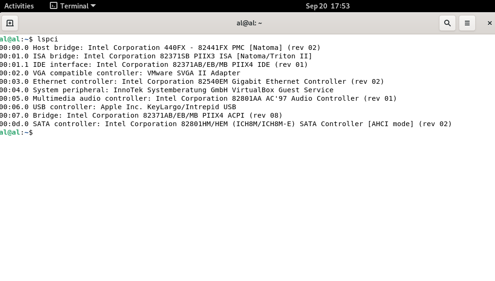
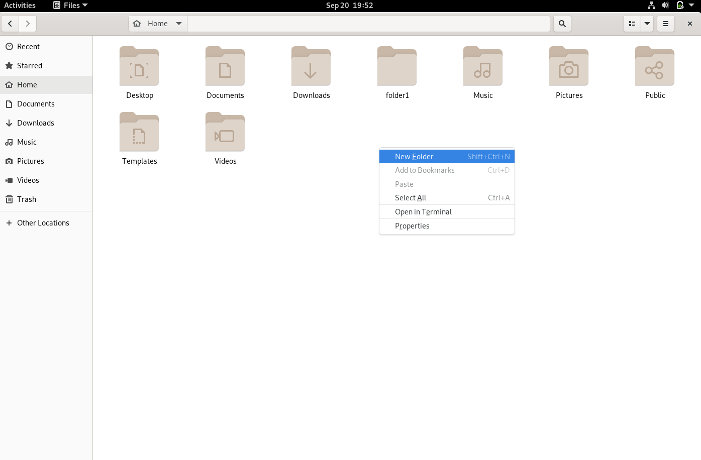
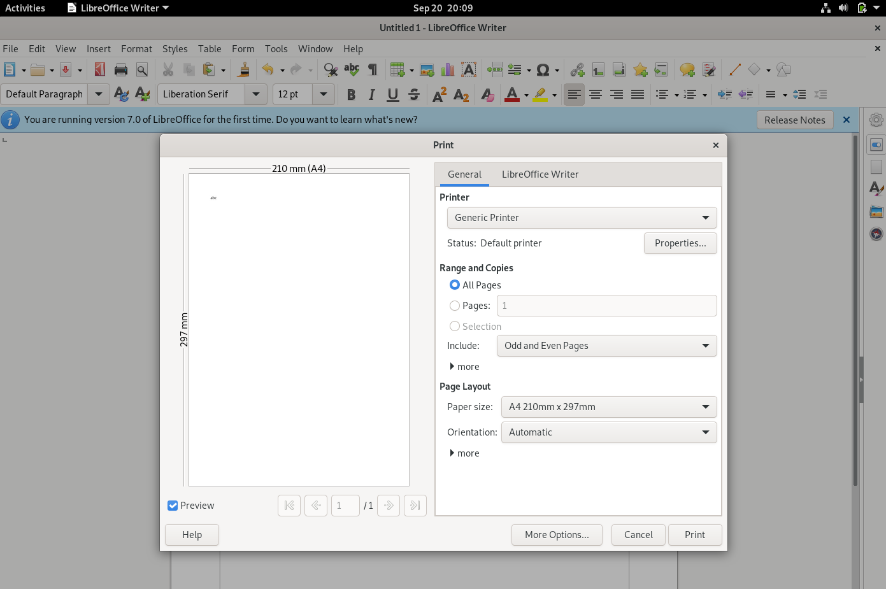

# Komponen Sistem Operasi

## 1. Manajemen Proses 

Proses adalah sebuah program yang sedang dieksekusi. Sebuah proses membutuhkan beberapa sumber daya untuk menyelesaikan tugasnya.

Alokasi sumber daya tersebut dikelola oleh Sistem Operasi Umpamanya penggunaan CPU, memori, berkas-berkas, dan perangkat-perangkat 

Sistem operasi bertanggung-jawab atas aktivitas-aktivitas yang berkaitan dengan manajemen proses seperti:

1. Membuat dan menghapus proses pengguna dan sistem proses. 
2. Menunda atau melanjutkan proses. 
3. Menyediakan mekanisme untuk sinkronisasi proses. 
4. Menyediakan mekanisme untuk komunikasi proses. 
5. Menyediakan mekanisme untuk penanganan deadlock. 

### Windows

### Linux

dari taks manajer di atas terlihat merupakan manajemen proses yang sedang berlangsung pada aplikasi yang sedang berjalan .contohnya seperti penggunaan CPU,Penggunaan Memory,Pengunaan battery,dll.

## 2.Manajemen Memori Utama

Memori utama atau lebih dikenal sebagai memori adalah sebuah array yang besar dari word atau byte, yang ukurannya mencapai ratusan, ribuan, atau bahkan jutaan. 

Setiap word atau byte mempunyai alamat tersendiri. Memori utama berfungsi sebagai tempat penyimpanan instruksi/data yang akses datanya digunakan oleh CPU dan perangkat Masukan/Keluaran.

Memori utama termasuk tempat penyimpanan data yang yang bersifat volatile tidak permanen yaitu data akan hilang kalau komputer dimatikan. 

Sistem operasi bertanggung-jawab atas aktivitas-aktivitas yang berkaitan dengan manajemen memori seperti: 
1. Menjaga track dari memori yang sedang digunakan dan siapa yang menggunakannya. 
2. Memilih program yang akan di-load ke memori. 

### Windows

### Linux

Dari gambar di atas dapat di lihat pengunaan memori dalam bentuk grafik.

## 3.Manajemen Sistem I/O

Sistem ini sering disebut dengan device manager. 
Menyediakan device driver yang umum sehingga operasi Masukan/Keluaran dapat seragam (membuka, membaca, menulis, menutup).

Contoh: pengguna menggunakan operasi yang sama untuk membaca berkas pada perangkat keras, CD-ROM dan floppy disk. 

Komponen Sistem Operasi untuk sistem Masukan/Keluaran: 
Penyangga: menampung sementara data dari/ke perangkat Masukan/Keluaran. 
Spooling: melakukan penjadwalan pemakaian Masukan/Keluaran sistem supaya lebih efisien (antrian dsb.). 
Menyediakan driver: untuk dapat melakukan operasi rinci untuk perangkat keras  Masukan/Keluaran tertentu. 

### Windows

### Linux

Dari gambar di atas terdapat beberapa perangkat input dan output yang terhubung.(Device Manajer.)

# Layanan Sistem Operasi

## 1.Eksekusi program
Eksekusi program adalah kemampuan sistem untuk "load" program ke memori dan menjalankan program yang dikehendaki user maupun sistem.

membuka dan menjalankan aplikasi

### Windows

### Linux

## 2.Manipulasi Sistem Berkas
Sistem manipulasi berkas adalah kemampuan program untuk operasi pada berkas (membaca, menulis, membuat, dan menghapus berkas yang berupa file atau direktori).

membuat file : klik kanan lalu pilih new folder

### Windows 

### Linux

## 3.Operasi Input/Output
Operasi I/O merupakan kegiatan dimana pengguna tidak dapat secara langsung mengakses sumber daya perangkat keras, sehingga sistem operasi harus menyediakan mekanisme untuk melakukan operasi I/O atas nama pengguna.

contohnya adalah pada print

### Windows

### Linux

# Sytem Call

system call (biasa di kenal sebagai "syscall") adalah sebuah instruksi, mirip dengan instruksi "add" atau "jump". Pada tingkat tinggi, sebuah system call adalah cara sebuah program pada level user untuk meminta pada sistem operasi untuk menjalankan sesuatu untuknya. Jika kita seorang programmer, dan kita membutuhkkan untuk membaca dari sebuah file, kita akan menggunakan system call untuk meminta sistem operasi untuk membaca file tersebut untuk kita.

Cara system call bekerja adalah sebagai berikut. Pertama-tama, user program akan mensetup argument untuk system call. Salah satu argumen adalah nomor system call. Perlu di catat bahwa semua ini dilakukan secara automatis oleh fungsi library kecuali jika kita menulis menggunakan bahasa assembler. Sesudah semua argumen di setup, program akan menjalankan instruksi "system call". Instruksi ini akan menyebabkan exception: event yang akan menyebabkan processor untuk jump ke satu address dan mulai menjalankan program / code di address tersebut.

Instruksi di alamat yang baru akan menyimpan state user program, menentukan sistem call apa yang kita inginkan, kemudian call fuction tersebut di kernel yang mengimplementasikan system call, setelah selesai maka mengembalikan program state, dan kembali ke user program. Sebuah system call adalah salah satu cara agar function yang di definisikan dalam device driver untuk bisa di panggil.

MS-DOS adalah contoh dari sistem single-tasking. MS-DOS menggunakan metoda yang sederhana dalam menjalankan program aan tidak menciptakan proses baru. 

Program di-load ke dalam memori, kemudian program dijalankan. Berkeley Unix adalah contoh dari sistem multi-tasking. Command Interpereter masih tetap bisa dijalankan ketika program lain dieksekusi. 

contohnya pada comand prompt / terminal

### Windows

### Linux

